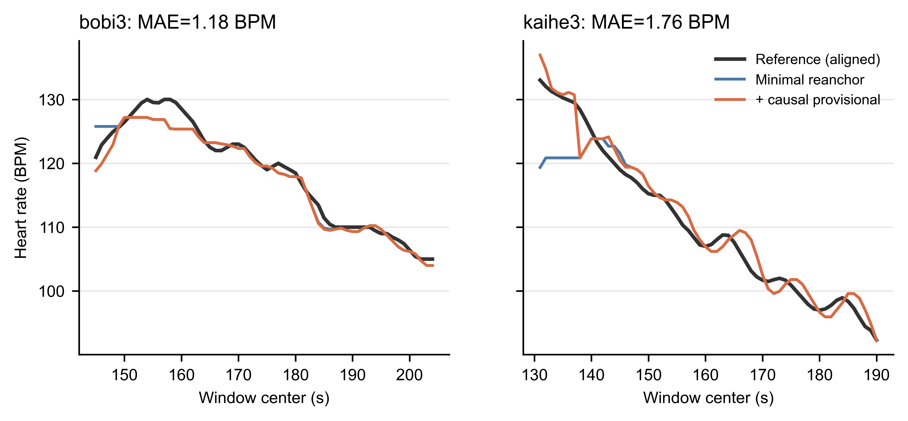
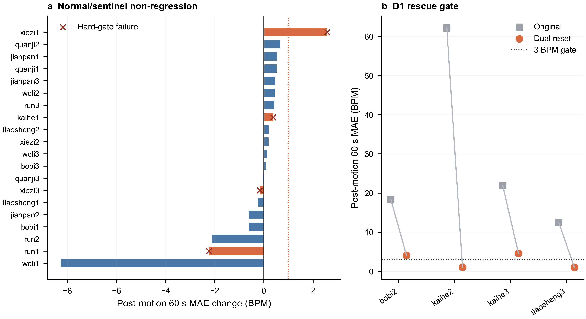

# 精简交接机制：YZY、HB24 与 Lite BO 扩展统计

> 2026-07-18 后续：`kaihe1` 尖刺已定位为 provisional 与正式消费之间的一窗控制权空洞，并通过连续晋升规则消除；YZY 4条退化样本重新 BO 后仍有退化。详见 `2026-07-18-kaihe1-transition-gap-yzy-bo.md`。

## 结论

按用户明确要求，在代表池已经 NO-GO 后继续完成了 YZY19 冻结回放、HB24 固定参数回放和 HB24 Lite BO `1×40`。扩展结果仍为 **NO-GO**，但补充了两点重要认识：

1. 机制的救援能力具有跨受试者证据：YZY `bobi3/kaihe3` 都从约 50 BPM 以上的误差降到 2 BPM 内。
2. 机制的介入边界仍不可靠：YZY 原本正常的 `kaihe2` 严重退化，HB24 仍有 `bobi2/kaihe3` 未达标及 `kaihe1` 下切—回跳；重新 BO 也没有消除这些问题。

因此当前问题不是“交接 tracker 完全无效”，而是算法还不能仅凭因果信号稳定判断何时应启用这条强救援路径。总体均值的大幅改善不能覆盖这种逐样本风险。

## 1. HB24 固定参数回放

固定使用上一轮每条样本的 Lite 参数，只比较机制，不重新优化。

| 指标 | 历史主分支 | provisional + reanchor |
|---|---:|---:|
| 24 条运动后 60 s 平均 MAE | 7.411 | 2.615 BPM |
| 4 条原失效样本平均 MAE | 28.702 | 2.671 BPM |
| 20 条正常样本平均 MAE | 3.150 | 2.604 BPM |
| 失效样本 `<3 BPM` | — | 2/4 |
| 未达标样本 | — | `bobi2=4.073`、`kaihe3=4.564` |
| bounce / 错误 hard switch | — | 1 / 0 |

唯一 bounce 出现在 `kaihe1`。这说明代表池中 `bounce=0` 不能外推到完整 HB24；扩大样本后，provisional 仍可能触发不符合生理连续性的先下切再回升。

## 2. YZY19 冻结压力评估

YZY 没有参与阈值、状态或参数设计。两个预先指定的同类失效目标均通过：

| 样本 | 原始 60 s MAE | 新 60 s MAE | 新 E20 |
|---|---:|---:|---:|
| `bobi3` | 54.302 | 1.178 BPM | 0 |
| `kaihe3` | 50.038 | 1.757 BPM | 0 |

图中参考心率已按各样本 `time_bias` 对齐。橙色 provisional 曲线在运动后 60 秒内基本沿着真实下降轨迹运行，说明利用切换前 Final 下降趋势的弱先验确实能跨受试者修复低频锁定。

但其余 17 条哨兵样本没有通过防退化：

- 平均 MAE 从 3.305 上升到 3.990 BPM。
- `kaihe2` 从 0.699 恶化到 11.536 BPM，增加 10.838 BPM，并新增 11 个 E20。
- `bobi1/jianpan1/kaihe2/run4` 出现新增 E20；其中 `run4` 和 `bobi1` 的 MAE也分别增加 1.565、1.342 BPM。
- 全部 YZY 样本的 bounce 与错误 hard switch 计数为 0；因此这些退化不是简单的来回跳变，而是错误介入后形成了持续偏差。

这组结果暴露出：当前资格与 ready 证据可以确认一条“看起来连续”的候选轨迹，却仍不足以确认旧 Final 先验已经失效。算法在真正跳水样本与本来就准确的 `kaihe2` 之间缺少可靠的因果区分条件。

## 3. HB24 Lite BO 1×40

批次严格使用 Lite 搜索空间、10 个 seed points、随机种子 42；每条样本 1 repeat × 40 iterations。主参考为 HF，ACC 只生成 LMS+A 对照，不参与 BO 选择或交接门控。批量审计结果为 `pass`，24 条样本、960 个 trials 及所有要求产物完整。

| 指标 | 历史主分支 | 新 BO |
|---|---:|---:|
| 24 条运动后 60 s 平均 MAE | 7.411 | 2.746 BPM |
| D1 达到 `<3 BPM` | — | 2/4 |
| D1 已救回 | — | `kaihe2`、`tiaosheng3` |
| D1 未解决 | — | `bobi2=4.073`、`kaihe3=4.564` |
| 最差新结果 | — | `run2=8.858 BPM` |
| 最大退化 | — | `xiezi1=+2.571 BPM` |
| 正常/哨兵硬门失败 | — | 4 条 |

图 a 显示大多数正常样本变化不大或改善，但 `xiezi1` 明显退化，`kaihe1/run1/xiezi3` 也因 E20 或错误切换未通过。图 b 显示四条原失效样本都大幅改善，但只有 `kaihe2/tiaosheng3` 低于 3 BPM；`bobi2/kaihe3` 仍位于门槛之上。BO 的 2.746 BPM 还略差于固定参数回放的 2.615 BPM，说明按全段 AAE 选优不会自动改善运动后 60 秒尾段。

### ACC 对照

| 方法 | 24 条平均全段 AAE | 平均静息 AAE |
|---|---:|---:|
| LMS+H（主结果） | 5.455 | 1.898 BPM |
| LMS+A（ACC 对照） | 9.325 | 2.864 BPM |
| 独立 reset FFT | 16.654 | 9.760 BPM |

ACC 对照完整生成，但在这批数据上整体弱于 HF 主参考；它没有参与参数选择，因此不会把 ACC 信息泄漏到当前机制结论中。

## 最终判断

扩展数据强化了“交接 reset 值得保留为研究方向”，但不支持当前实现并入主算法：

- 支持保留：下降趋势弱先验、单一 Final 写入点、正式 ready 优先、独立 reset 不变量、全 hard-switch 审计和 HF/ACC 分离。
- 阻止合入：HB `bobi2/kaihe3` 绝对门槛失败、HB `kaihe1` bounce/错误切换、YZY `kaihe2` 严重持续退化，以及 BO 后 4 条正常/哨兵硬门失败。
- 不建议继续做法：围绕这些样本继续增加新的安全门或阈值；这会重新扩大状态层次，并可能把 YZY 降格成新的调参集。

## 产物与复现

- HB24 固定参数：`data/202607-multiperson/0711-HB/v2_batch_outputs/20260717_minimal_provisional_expansion_fixed_hb24`
- YZY19 固定回放：`data/202607-multiperson/0714-YZY/v2_batch_outputs/20260717_minimal_provisional_expansion_fixed_yzy19`
- HB24 Lite BO：`data/202607-multiperson/0711-HB/v2_batch_outputs/20260717_minimal_provisional_hb24_lite_1x40_expansion`
- 统一机器摘要：上述 BO 目录下 `expansion_analysis/expansion_summary.json` 和 `yzy19_metrics.csv`
- 24 条完整心率曲线：上述 BO 目录下 `comparison/hb24_hr_curves.png/.svg/.pdf`
- 批量协议与 ACC 审计：上述 BO 目录下 `batch_audit.json`
