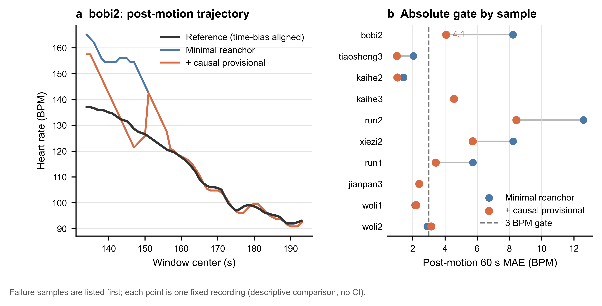

# 运动后静息精简交接机制：最终实验报告

## 结论

本轮结论为 **NO-GO**：当前 `minimal_reanchor` 及其唯一允许的调整版 `minimal_provisional_reanchor` 均不应并入主算法，也不继续进入 YZY、HB24 全量或 Lite BO。

恢复 ready 前的因果 provisional 交接后，10 条 HB 代表样本的运动后 60 s 平均 MAE 从 5.025 降至 3.601 BPM，说明“尽早利用下降轨迹”确实有效；但关键样本 `bobi2` 仍为 4.073 BPM，未达到预先声明的 `<3 BPM` 绝对门槛，并且丢失了 N5 已有的 `<3 BPM` 救援结果。因此，不能用总体均值改善覆盖关键绝对门槛失败。

图 a 使用已完成 time-bias 对齐的参考心率。provisional 交接显著减小了 `bobi2` 运动结束初期的偏高，但在约 150 s 附近仍出现一次明显回升，最终没有把全 60 s MAE 压到 3 BPM 以下。图 b 显示该调整对大部分样本有收益，但 `bobi2`、`kaihe3`、`run2`、`xiezi2` 仍高于绝对门槛；这组数据是固定录制样本的描述性比较，不使用置信区间作推断。

## 本轮机制及其约束

精简候选只保留一条受控交接路径：

1. 独立 reset FFT 继续独立计算，不修改其峰值或重新初始化逻辑。
2. 交接 tracker 在运动后积累候选轨迹；正式目标满足 `target_consumable` 后，由唯一写入点切换 Final。
3. `controlled_reanchor` 只允许一次受控重锚；正式交接一旦发生便不可回退到 archived 路径。
4. `gap_rescue` 仍是快速硬切，但所有硬切事件都接受错误方向与 bounce 审计。
5. 实验调整只恢复已有的 ready 前因果 `bootstrap_provisional`，不引入新质量特征、新阈值或样本特判；正式 ready 目标必须优先于 provisional。

相比原复杂分支，这一设计把“候选生成、是否可消费、Final 唯一写入”分开，并保持独立 reset FFT 的逐窗值、raw top-5 与 trace 不变。

## 定量结果

| 指标 | `minimal_reanchor` | `+ causal provisional` |
|---|---:|---:|
| 失效池 post-motion 60 s MAE | 4.061 | 2.671 BPM |
| 正常池 post-motion 60 s MAE | 5.667 | 4.221 BPM |
| 10 条样本总体 MAE | 5.025 | 3.601 BPM |
| 相对实验基线的正常池变化 | 0.000 | -1.446 BPM |
| 相对实验基线的失效池变化 | 0.000 | -1.391 BPM |
| `bobi2` post-motion 60 s MAE | 8.221 | 4.073 BPM |
| 丢失已有 `<3 BPM` 救援 | 1 | 1 |
| bounce / 错误 hard switch | 0 / 0 | 0 / 0 |
| 平均控制状态 / 转换次数 | 4.1 / 3.1 | 4.6 / 3.8 |
| 独立 reset 不变量 | 通过 | 通过 |

## 关键诊断：为什么最初的“GO”无效

首次实现曾得到 `bobi2=2.999 BPM`，看似过线。复核发现 provisional 分支错误地抢在正式 `target_consumable` 之前执行，导致 231 个已经 ready 的窗口仍被标记为 `bootstrap_provisional`，没有进入不可逆的正式交接；ready 随后撤销时，Final 还能回到 archived 路径。

这不是目标机制的合法收益，而是交接状态被遮蔽造成的假阳性。修复为“正式目标优先、正式切换不可逆”并重跑相同代表池后，`bobi2` 回升至 4.073 BPM，最终判为 NO-GO。该结果说明：N5 的最佳 `bobi2` 表现部分依赖 provisional/ready 之后的回退语义，而这与本轮希望建立的单写入、不可逆交接原则存在实质冲突。

## 保留的成果与已知风险

可以保留：

- 运动后早期冻结 tracker 会错失下降轨迹，因果 provisional 对此有明确平均收益。
- 单一 Final 写入点、正式交接优先、独立 reset 不变量与全 hard-switch 审计能够消除假阳性。
- 批量门禁已强制要求完整 HB24 清单、HF 主输入及 ACC 对照；缺项会 fail-closed。

不能保留为主算法候选：

- 当前两个精简候选及其 provisional 调整版。
- 通过继续叠加质量门、安全门或样本阈值修补 `bobi2`；这会重新引入本轮希望消除的状态复杂度和过拟合风险。

部署层面，核心逐窗选择仍可做到峰候选数 `O(K)`、常量状态 `O(1)`，实时计算本身不是主要问题；风险在于研究代码保留了逐窗 trace/timeline，内存为 `O(W)`，且状态与转换数在 provisional 版本中略有增加。进入嵌入式部署前仍需将诊断 trace 改为可关闭或环形缓冲，并单独测量目标硬件耗时与内存。

## 验证边界与复现

- 代表池：HB 10 条，包括原失效样本和正常哨兵。
- 机器产物：`data/202607-multiperson/0711-HB/v2_batch_outputs/20260717_minimal_provisional_adjustment_representative`。
- 图形源数据：该目录下 `sample_metrics.csv` 与 `window_metrics.csv`；图形脚本为 `python/src/ppg_hr/v2/plot_post_motion_minimal_final.py`。
- 全量 Python 回归：`672 passed, 31 skipped`；按项目约定排除缺失 fixture 的 `python/tests/test_v2_window_diagnostics.py`。
- YZY 未运行，HB24 固定参数验证和 Lite BO 未启动，主算法默认行为未改变。

本轮按约定只允许一次调整实验，现已停止。后续若重新开启研究，应先提出能同时解释“早期需要 provisional”与“正式交接不可回退”的更简单因果模型，再以新的预注册门槛单独立项；不应在本候选上继续追加局部补丁。
