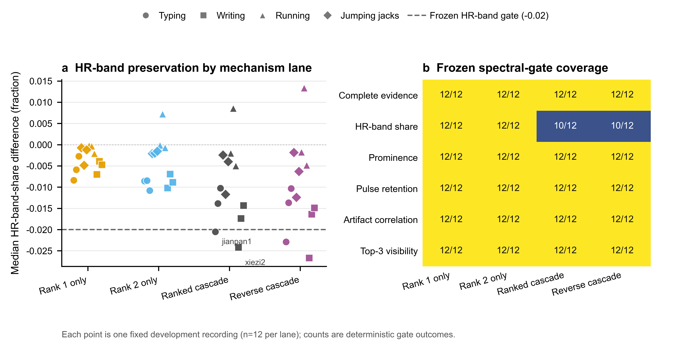

# LYX 滤波机制分解零运行结果

## 结论

在 12 条 LYX 开发复用记录、冻结的 `p25-short-low` 参数和同一套频谱证据门槛下，两个单级自适应通道均为 12/12 通过，正向与反向双级联通道均为 10/12 通过。两条双级联通道失败的是同一组记录，即 `jianpan1_LYX_0708` 与 `xiezi2_LYX_0708`；将正向双级联缩减为 `rank1_only_adaptive` 后，两条记录均转为通过，其余 10 条记录没有新增回退。

这一结果将当前局部失效机制定位到两个参考级的串行组合，而不是预处理、零更新时的双级结构或参考顺序。下一步应验证“保留第一参考级、移除第二参考级”的最小滤波修订，不需要进入参数搜索或独立 BO。

图 a 展示每条开发记录在四个自适应通道上的心率频带能量占比中位差，虚线为冻结门槛 `-0.02`。图 b 展示六项冻结频谱门槛的逐通道通过数。每个通道均为同一批 12 条记录的确定性配对结果，未进行推断统计或跨样本汇总检验。

## 实验问题

上一轮 `p25-short-low` 复验在 12 条记录中得到 10/12 通过，剩余失败均来自 `hr_band_share_delta_pass`。本次零运行只回答一个机制问题：失败主要由哪一部分滤波结构引入？

实验没有调整 `fs_target`、记忆长度、`mu`、窗口规则或频谱门槛，也没有搜索新的参数组合。六个通道在同一条记录、同一批窗口和同一冻结配置上配对计算：

1. `raw_bypass`：绕过滤波。
2. `two_stage_zero_update`：保留双级结构，但两级均不更新。
3. `rank1_only_adaptive`：只运行第一参考级。
4. `rank2_only_adaptive`：只运行第二参考级。
5. `ranked_cascade_adaptive`：复现原正向双级联。
6. `reverse_cascade_adaptive`：交换两级顺序。

本次面板覆盖写字、敲键盘、跑步和开合跳四个场景，每个场景 3 条记录。证据类别为 `development_reuse_pilot`，不是算法级留出验证。

## 结果

### 控制与复现均有效

- `raw_bypass` 为 12/12 通过。
- `two_stage_zero_update` 为 12/12 通过，最大更新权重为 0。
- `ranked_cascade_adaptive` 对既有锚点结果为 12/12 精确复现。
- 12 个身份全部由求解器完成，缓存命中、失败尝试和重试均为 0。

因此，本次差异不能由窗口漂移、控制通道失效或既有结果复现失败解释。

### 串行双级组合是当前局部失效来源

| 通道 | 完整通过数 | 心率频带能量占比中位差范围 |
|---|---:|---:|
| `rank1_only_adaptive` | 12/12 | -0.00837 至 -0.00021 |
| `rank2_only_adaptive` | 12/12 | -0.01082 至 0.00721 |
| `ranked_cascade_adaptive` | 10/12 | -0.02420 至 0.00856 |
| `reverse_cascade_adaptive` | 10/12 | -0.02668 至 0.01333 |

除心率频带能量占比门槛外，完整窗口证据、峰显著性、脉搏功率保留、伪影相关性和 Top-3 可见性五项门槛在四个自适应通道上均为 12/12 通过。正向和反向双级联都在同两条记录上失败，说明仅交换处理顺序不能解除失效。

两条失败记录的配对变化如下：

| 记录 | 第一参考级 | 第二参考级 | 正向双级联 | 反向双级联 |
|---|---:|---:|---:|---:|
| `jianpan1_LYX_0708` | -0.00837 | -0.00856 | -0.02051 | -0.02289 |
| `xiezi2_LYX_0708` | -0.00702 | -0.01022 | -0.02420 | -0.02668 |

冻结门槛为 `-0.02`。相对正向双级联，`rank1_only_adaptive` 的配对转移为 2 条失败转通过、0 条通过转失败、10 条保持通过。

## 解释与边界

这组证据支持“第二次串行自适应更新会在部分记录上累积削弱心率频带能量”的局部解释。零更新双级结构通过，说明问题不是仅由双级数据流本身造成；反向双级联仍失败，说明简单改变级联顺序不足以修复；两个单级通道均通过，则把问题进一步约束到串行组合，而不是某一个参考级必然无效。

选择 `rank1_only_adaptive` 作为实现候选，并不表示第一参考级在本面板上显著优于第二参考级。`rank2_only_adaptive` 同样为 12/12 通过。选择第一参考级的理由是它保留现有“优先使用第一排序参考”的约定，只删除第二级，因此代码改动和行为解释最小。

本结果不能支持以下结论：

- 不能证明该修订已经跨场景泛化，四个场景仍属于同一开发机制面板。
- 不能证明跨个体泛化，全部记录来自 LYX。
- 不能替代主比较基线。后续主比较仍应使用每个样本的独立 BO lite 结果；`TraceRescue` 只作为历史探索背景。
- 不能直接进入 Stage R、Stage F 或恢复候选提名。

## 下一步

下一步只实施一个最小变更：在生产滤波路径中保留第一参考级的选择与自适应更新，移除第二参考级的串行更新。修订验证必须先证明：

1. 新路径在 12 条记录上逐记录复现本次 `rank1_only_adaptive` 通道；
2. 12/12 通过全部冻结频谱门槛；
3. 相对原 `p25-short-low` 正向双级联为 2 条失败转通过、0 条新增失败；
4. 没有参数搜索、独立 BO、Stage R/F 或候选提名。

只有最小修订验证通过后，才讨论是否进入更强的场景或个体泛化验证。若后续确实需要完整独立 BO，必须单独提交人工审核。

## 审计信息

- proposal SHA-256：`94c9264dbbdd8cdd299cf502c1ef1ba0e859000c9c72a1c35fc490eb46eccfab`
- completion SHA-256：`4099eac8231342b014ed0363a49db28afd682a7b623f07248f8f4d88320ee8e8`
- decision SHA-256：`b01ff36a82596b11de10290f8225f7bc979e7886ecda8f84ec138e4301ff3304`
- result manifest 文件 SHA-256：`ecaf0734b30e293291b560e1a84a3a9e7e1834f50dbbcb664fa3a696b487c81c`
- 图表摘要 SHA-256：`acef3394055a8f31f954ea0d28b51f01cdd682d9b55989aca1a98fb04b45fbdb`
- 参数搜索运行数：0
- 独立 BO 运行数：0
- 自动 Stage R / Stage F：否 / 否
- 可提名恢复候选：否

结构化证据：

- [逐记录逐通道指标](assets/2026-07-30-lyx-filter-mechanism-decomposition/filter_mechanism_decomposition_record_metrics.csv)
- [机器可读摘要](assets/2026-07-30-lyx-filter-mechanism-decomposition/filter_mechanism_decomposition_summary.json)
- [SVG 矢量图](assets/2026-07-30-lyx-filter-mechanism-decomposition/filter_mechanism_decomposition.svg)
- [PDF 矢量图](assets/2026-07-30-lyx-filter-mechanism-decomposition/filter_mechanism_decomposition.pdf)
