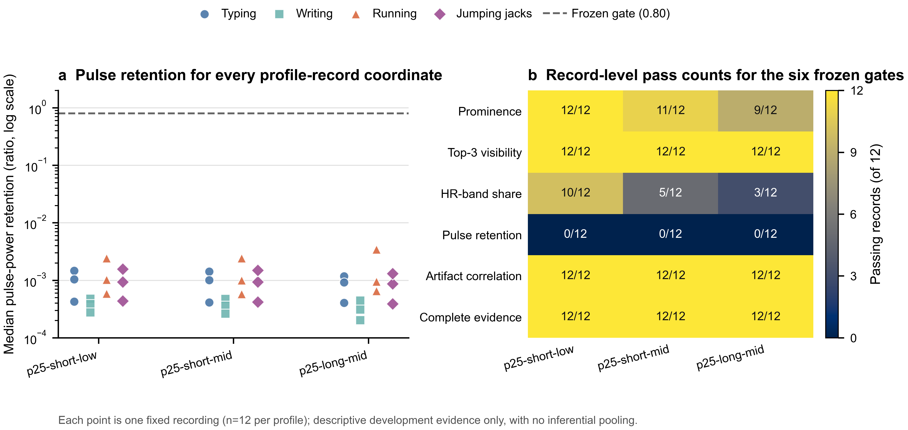

# LYX p25 候选无关频谱诊断：三个档位均触发量纲控制审计

日期：2026-07-30  
证据等级：开发复用试验（`development_reuse_pilot`）  
适用范围：LYX 写字、敲键盘、跑步、开合跳共 12 条机制开发记录

## 结论

经人工批准的 proposal
`db1f5d2278458592c08d7e6217d52090a8ab1f94b96262de99e84a466e2c6128`
已完成全部 36 个 `filter_profile_p25_spectral_diagnostic` 身份。三个冻结 p25
档位均有完整的 12 条记录证据，但没有任何档位通过完整频谱门；36 个坐标全部被
`pulse_power_retention` 拦截。因此，当前机械决策为
`spectral_metric_control_audit_required`，不得提名恢复候选，也不得进入 Stage R
重跑、Stage F 或独立 BO。

这一结果不能直接解释为三个 p25 档位都严重破坏了脉搏成分。当前评估代码把原始
尺度的滤波前 PPG 与 `lms_filter` 返回的标准化残差用于同一个功率比，存在量纲不
一致的明确风险。该代码证据只形成“频谱指标口径可能失效”的首要机制假设，不会
改写已冻结的 36 个观测值；在零更新和直接旁路控制复核前，也不能据此宣布滤波档
位有效或无效。

## 执行与治理闭环

| 项目 | 结果 |
|---|---:|
| 计划诊断身份 | 36 |
| 完成诊断身份 | 36 |
| 新 solver 运行 | 36 |
| 缓存命中 | 0 |
| 失败 / 重试 | 0 / 0 |
| 独立 BO 运行 | 0 |
| v6 预算修订后实际不同身份数 | 276 |
| 当前状态 | `spectral_metric_control_audit_required` |
| 下一状态 | `awaiting_spectral_metric_control_audit` |

授权 SHA 为
`3e5b795f91b87f22af49bfa7445c45eab206e77c2581242d9c257113a08bf91a`；
完成回执 SHA 为
`81171332c7c29e80f329c9140874480321bf101ca7f91c853c3ae453015251ac`；
机械决策 SHA 为
`29f042e080441ae979fea32e0b38c9de8ac778fc71d3bd5d99d78ba8ba763f55`。
三者与冻结 proposal、v6 预算合同和 36 个物化频谱审计哈希一致。
Git 发布范围采用 provenance-only 合同：完整提交本轮 36 份物化审计、manifest、
结果索引与治理哈希，但不把包含 240 份继承物化及轨迹/solver sidecar 的本地缓存
误称为可移植重放包。边界与最终账本文件哈希记录在
`governance_v6/portable_provenance_receipt.json`。

## 结果

图 a 保留全部 36 个原始记录级坐标，不以均值或场景汇总掩盖分布。三个档位的脉搏
功率保留率均集中在约 \(10^{-4}\)–\(10^{-3}\)，与 0.80 冻结门相差三个数量级；
最低值、总体中位数和最高值分别为 0.000203、0.000759 和 0.003429。写字、敲键
盘、跑步和开合跳四类场景均出现同一量级，没有迹象表明失败只由某一个场景驱动。

图 b 显示该异常具有很强的子门特异性：完整窗口证据、Top-3 可见性和伪影相关性
三项均为 36/36；prominence 为 32/36，HR-band share 为 18/36；唯有脉搏功率保
留率为 0/36，并使三个档位的完整频谱门均为 0/12。

| 档位 | 记录数 | pulse retention 最小值 | 中位数 | 最大值 | 完整频谱门 |
|---|---:|---:|---:|---:|---:|
| `p25-short-low` | 12 | 0.000276 | 0.000760 | 0.002416 | 0 / 12 |
| `p25-short-mid` | 12 | 0.000263 | 0.000755 | 0.002405 | 0 / 12 |
| `p25-long-mid` | 12 | 0.000203 | 0.000759 | 0.003429 | 0 / 12 |

逐记录指标表位于
[`p25_spectral_record_metrics.csv`](assets/2026-07-30-lyx-p25-spectral-diagnostic/p25_spectral_record_metrics.csv)，
机器可读汇总位于
[`p25_spectral_summary.json`](assets/2026-07-30-lyx-p25-spectral-diagnostic/p25_spectral_summary.json)。

## 机制解释与边界

在当前调用链中，`audit_stage_r_profile_record` 先把
`prepared.ppg[idx_s:idx_e]` 保存为 `original`，随后把 `current` 传入
`lms_filter`。后者会分别对参考信号和期望信号做 z-score，并返回标准化空间中的
残差；频谱门最终把 `original` 作为 `before`、把该残差作为 `after` 计算 HR 邻域
功率比。若两者没有被还原到共同尺度，则该比值不再只反映脉搏成分的相对保留，而
会同时携带输入方差的尺度因子。

这一解释与“所有档位和场景都出现约 \(10^{-3}\) 的保留率，而其他多个相对频谱门
仍能通过”的观测相容，但目前仍是代码支持的诊断假设，不是经控制实验确认的结论。
至少还需要区分：

1. 评估器的滤波前后尺度不一致；
2. 零更新 LMS 路径本身改变了输出尺度；
3. 当前自适应更新确实过度抑制了脉搏能量；
4. 多级串联或延迟/阶数路径进一步放大了上述效应。

12 条记录都已参与机制和规则开发，故这些结果只能支持 LYX 个体内开发诊断，不能
支持未见场景、跨个体或算法级留出泛化结论。四场景覆盖在本轮的价值，是证明该异
常并非仅限于低生理波动的写字/键盘场景；它不改变数据复用边界。

## 下一步机械分支

下一步应准备一份新的、精确哈希绑定的频谱量纲控制 proposal，在每条记录内同时计
算直接旁路与零更新 LMS 控制，使两种输出在同一尺度下比较。最小设计以 12 条记录
为独立诊断身份，每个身份内部完成两种确定性控制，不搜索参数，也不运行独立 BO。

控制结果的预期判据为：

- 若直接旁路接近 1、零更新 LMS 仍接近当前 \(10^{-3}\)，则优先修正
  `lms_filter` 输出或评估器尺度契约；
- 若两种控制均接近 1，而当前 p25 结果仍接近 \(10^{-3}\)，才把过度自适应抑制列
  为主要解释；
- 只有修正后的频谱指标通过控制验证、而 p25 档位覆盖仍不足以解释记录差异时，才
  提交完整独立 BO 的新人工审核提案。

在新的 proposal、身份清单、预算合同与人工授权全部冻结前，不执行上述 12 个新诊
断身份。
