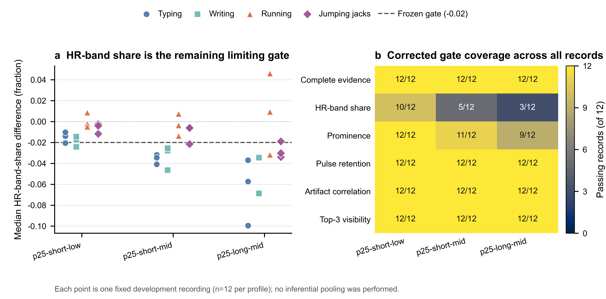

# LYX p25 修正量纲频谱复验：短记忆低收缩档接近通过，但仍不足以进入 Stage R

日期：2026-07-30

证据等级：开发复用试验（`development_reuse_pilot`）

适用范围：LYX 写字、敲键盘、跑步、开合跳各 3 条机制开发记录

算法级留出：`false`

## 结论

经人工批准的 proposal
`83081d8081def70b356b2737864b552c3fc2376817bbc595db32f4f650616c26`
及 v8 预算已完成执行。36 个
`filter_profile_p25_spectral_recheck_v2` 身份全部产生新结果，无缓存替代、失败或
重试，也没有运行参数搜索、独立 BO、Stage R 或 Stage F。

量纲修正确实消除了上一轮的伪失败：三个档位的脉搏功率保留率均为
12/12 通过，总体范围由旧口径下约 \(10^{-3}\) 恢复为
0.8597–1.2988。然而，没有任何档位达到冻结规则要求的 12/12 完整频谱通过。
最接近要求的 `p25-short-low` 为 10/12；其余两个档位分别为 5/12 和 3/12。
机械决策因此为 `p25_failure_review_required`，当前状态为
`awaiting_human_filter_mechanism_or_independent_bo_review`。

当前证据不支持立即运行独立 BO。失败已经集中到心率频带占比，而不是普遍的
滤波不稳定、脉搏功率损失或伪影相关恶化；同时，更长记忆或更强收缩呈现更差的
通过覆盖。更合适的下一步是先设计一个有界、零运行的滤波机制分解方案，明确
级联恢复、参考通道和收缩如何侵占心率频带，再决定是否需要 BO。

## 执行与治理闭环

| 项目 | 结果 |
|---|---:|
| 计划 / 完成诊断身份 | 36 / 36 |
| 新 solver 运行 | 36 |
| 缓存替代 | 0 |
| 失败 / 重试 | 0 / 0 |
| 参数搜索运行 | 0 |
| 独立 BO 运行 | 0 |
| Stage R / Stage F 自动执行 | `false` / `false` |
| 恢复候选提名权限 | `false` |

授权回执 SHA-256 为
`a072e27b63b45f3b5c9104d7c4d6df02cda77d3fd2b0afed2712cd12f6d34313`；
v8 预算合同 SHA-256 为
`bcc55f467c19e6e1c0975c776d3d4356d4034ce5cf8e0ec343c99877f8a84109`；
治理准备回执 SHA-256 为
`9436c45c1dd007c6632f4b5d639d68e53a1d0d397acced15ee5fec105ca25b7d`。
执行完成回执 SHA-256 为
`f66ac4bde326ce3b2cc25738176ea5613cec9c9b9ee91862557ddf44d9009076`，
机械决策 SHA-256 为
`fd05114792fd04b276a114a6ac9e9292089da544883d1b98a6f7e91832fd5684`。
执行后账本记录 324 个已计划且已实际运行的唯一身份；本轮没有突破 v8 上限。

## 修正后的频谱结果

图 a 保留每条开发记录的心率频带占比差，虚线为冻结门槛
`hr_band_share_delta >= -0.02`。`p25-short-low` 的大多数记录位于门槛以上，
而 `p25-short-mid` 和 `p25-long-mid` 的负向尾部依次扩大。图 b 显示，完整
窗口证据、脉搏功率保留、残余伪影相关和 Top-3 可见性均为 36/36 通过；剩余
主要限制是心率频带占比，仅 18/36 通过，峰突出度另有 4/36 失败。

| 档位 | 完整通过 | 心率频带占比 | 峰突出度 | 脉搏功率保留 | 伪影相关 | Top-3 可见性 |
|---|---:|---:|---:|---:|---:|---:|
| `p25-short-low` | 10/12 | 10/12 | 12/12 | 12/12 | 12/12 | 12/12 |
| `p25-short-mid` | 5/12 | 5/12 | 11/12 | 12/12 | 12/12 | 12/12 |
| `p25-long-mid` | 3/12 | 3/12 | 9/12 | 12/12 | 12/12 | 12/12 |

`p25-short-low` 的心率频带占比差中位数为 -0.01097，范围为
-0.02420–0.00856。两个失败坐标分别是：

- `jianpan1_LYX_0708`：-0.02051，仅比冻结门槛低 0.00051；
- `xiezi2_LYX_0708`：-0.02420，比冻结门槛低 0.00420。

这两个坐标的脉搏功率保留率仍分别为 0.9723 和 0.9596，峰突出度与其他四项门
也全部通过。因此，不能把它们解释为滤波整体失效。逐记录源数据见
[`p25_spectral_recheck_record_metrics.csv`](assets/2026-07-30-lyx-p25-spectral-recheck/p25_spectral_recheck_record_metrics.csv)，
机器可读汇总见
[`p25_spectral_recheck_summary.json`](assets/2026-07-30-lyx-p25-spectral-recheck/p25_spectral_recheck_summary.json)；
图的可编辑版本同时提供
[`PDF`](assets/2026-07-30-lyx-p25-spectral-recheck/p25_spectral_recheck.pdf)
和
[`SVG`](assets/2026-07-30-lyx-p25-spectral-recheck/p25_spectral_recheck.svg)。

## 机制解释

第一，上一轮的脉搏功率保留率塌缩没有复现。修正量纲后 36/36 通过，说明量纲
失配诊断和 v2 合同修订有效，也把“p25 档位普遍抹除脉搏功率”从当前主要解释中
排除。

第二，失败并非由数值不稳定或窗口缺失驱动。36 个坐标均通过稳定性和完整窗口
证据，残余伪影相关与 Top-3 可见性也全部通过。当前问题更具体：滤波后心率邻域
功率仍存在，但它在完整心率频带总功率中的相对占比可能下降。

第三，档位间结果具有方向性。由 `p25-short-low` 到 `p25-short-mid`，再到
`p25-long-mid`，完整通过数从 10 降到 5 和 3；心率频带占比差中位数从
-0.01097 降到 -0.02349 和 -0.03420。这个序列与更强收缩、更长记忆造成更大
生理频带侵入的机制解释一致。它不是独立因果试验，因为记忆长度和收缩强度没有
完全正交，但足以反对“只需扩大同一耦合空间的黑盒搜索”作为第一动作。

## 竞争解释与证据边界

`p25-short-low` 的两个失败值接近门槛，因此冻结阈值可能偏保守；但门槛已在
真实复验前冻结，不能因 10/12 的结果而事后放宽。相反，应通过机制分解判断这
两个记录是级联中某一级、某类运动参考或收缩项导致的可重复损失，还是记录级
自然波动。

全部 12 条记录都已用于机制与规则开发。结果只支持 LYX 个体内、四个既有场景
的开发判断，不是算法级留出，也不能证明未见场景、重新佩戴、跨日期或跨个体
泛化。参考心率在本轮只用于离线频谱证据，当前决策没有计算最终心率误差或恢复
时序收益。`TraceRescue` 仍是历史探索方法，不是本轮主要比较基线；后续性能
比较仍应以每条记录的独立 BO-lite 结果为主。

## 下一步人工门

本轮已按预注册决策树停止，没有生成独立 BO 审核包。建议选择以下 A 路径：

1. **A：滤波机制分解（建议）**。先撰写零运行 spec/proposal，冻结少量正交消融，
   分开检查级联第一/第二级、参考通道与收缩项对心率频带占比的贡献；任何新增
   诊断身份和预算继续单独审批。
2. **B：独立 BO 审核包**。只有在认为现有预定义档位不能代表可用机制空间时，
   才先准备完整独立 BO 的预算、停止规则与人工审核包；准备审核包仍不等于批准
   运行 BO。

若 A 路径能得到机制可解释且在 12/12 开发记录上安全的冻结档位，再发布新的
Stage R sentinel proposal；若有界机制分解仍无法恢复覆盖，届时才有充分理由
升级到独立 BO 人工审核。

## 主张—证据映射

| 主张 | 证据 | 状态 |
|---|---|---|
| v2 量纲修正消除了旧保留率伪失败 | 36/36 脉搏功率保留通过，范围 0.8597–1.2988 | 直接支持 |
| 当前主要限制是心率频带占比 | 该门仅 18/36 通过；四个其他频谱门为 32–36/36 | 直接支持 |
| `p25-short-low` 最接近完整安全 | 完整通过 10/12，其余为 5/12 和 3/12 | 直接支持 |
| 更强收缩或更长记忆可能侵入生理频带 | 三档位覆盖与中位数呈一致恶化序列 | 支持机制假设，尚非正交因果证明 |
| 现在必须运行独立 BO | 失败局部且存在 10/12 的近似安全档位 | 不支持 |
| 机制可跨个体泛化 | 当前只有 LYX、无算法级留出 | 不支持 |
