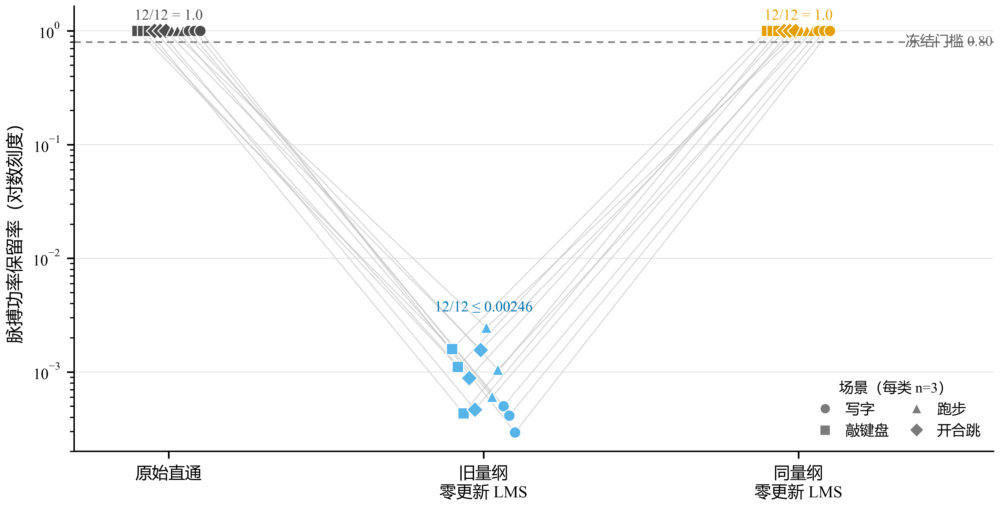

# LYX 频谱量纲控制：旧评估口径在四场景 12/12 复现尺度失配

日期：2026-07-30
证据等级：开发复用试验（`development_reuse_pilot`）
适用范围：LYX 写字、敲键盘、跑步、开合跳各 3 条机制开发记录
算法级留出：`false`

## 结论

经人工批准的 proposal
`429233ecadf92cc2d669b59c8f2cc4516b3d767547d98919655a18918e1a60bd`
已完成全部 12 个 `spectral_metric_scale_control_diagnostic` 身份。
三个确定性通道形成一致的因果排除链：原始直通和同量纲零更新 LMS 的
脉搏功率保留率都在 12/12 条记录上等于 1.0；只有把原始幅值域
`before` 与标准化 LMS 残差直接比较的旧量纲通道降至
0.000294–0.002459，中位数为 0.000745。机械决策因此为
`legacy_scale_mismatch_confirmed`，下一状态为
`awaiting_spectral_metric_scale_correction`。

该结果表明，上一轮 p25 诊断中约 \(10^{-3}\) 的保留率首先来自评估器输入量纲
不一致，而不是零更新 LMS 本身破坏了脉搏能量。它没有证明任何 p25 档位已经
满足频谱安全门，也不允许据此提名恢复候选、启动 Stage R、Stage F 或独立 BO。

## 术语与口径

| 规范术语 | 本报告定义 |
|---|---|
| 原始直通 | `before` 与 `after` 都使用同一原始 PPG 窗口 |
| 旧量纲零更新 LMS | `before` 使用原始幅值域，`after` 使用零更新 LMS 返回的样本 z-score 残差 |
| 同量纲零更新 LMS | `before` 与 `after` 都使用每窗样本 z-score（`ddof=1`） |
| 脉搏功率保留率 | 参考心率邻域的 `after` 功率除以同一窗口的 `before` 功率 |
| 失配复现 | 直通通过、同量纲零更新通过，且旧量纲/同量纲保留率比值不超过 0.10 |

本报告固定使用“量纲”描述评估表示的尺度口径，不把该问题称为滤波参数失效。

## 执行与治理闭环

| 项目 | 结果 |
|---|---:|
| 计划 / 完成诊断身份 | 12 / 12 |
| 新 solver 运行 | 12 |
| 缓存命中 | 0 |
| 失败 / 重试 | 0 / 0 |
| 参数搜索运行 | 0 |
| 独立 BO 运行 | 0 |
| 直接旁路通过 | 12 / 12 |
| 同量纲零更新通过 | 12 / 12 |
| 旧量纲失配复现 | 12 / 12 |
| 恢复候选提名权限 | `false` |
| Stage R / Stage F 自动执行 | `false` |

v7 治理迁移先产生 `prepared_zero_runs` 回执，再执行获批身份。治理回执 SHA-256
为 `c752cecef04a22c1c29205740f0c612037e141771911fd8c8353e5c55ea939cb`；
完成回执 SHA-256 为
`338c73c2360b7bd0d7fad849fbdd84e6b991c1fa1eb823068e8a990ff937a5d0`；
机械决策 SHA-256 为
`4aa202167f754532e8e23318906ba3075ae4807f58080f4ae4a9eed00782f980`。

## 三通道结果

图中保留全部 12 条记录级配对轨迹，并使用对数纵轴呈现跨三个数量级的差异。
灰色虚线是冻结的 `pulse_power_retention >= 0.80` 门槛。原始直通与同量纲零更新
通道均为 1.0，说明直接旁路和零更新 LMS 在同一表示域内都不会产生脉搏功率
损失；旧量纲通道的所有点都位于 \(10^{-4}\)–\(10^{-3}\) 数量级，并在四个场景
中同时出现。

| 场景 | 记录数 | 旧量纲 / 同量纲最小值 | 中位数 | 最大值 | 失配复现 |
|---|---:|---:|---:|---:|---:|
| 写字 | 3 | 0.000294 | 0.000414 | 0.000502 | 3 / 3 |
| 敲键盘 | 3 | 0.000432 | 0.001109 | 0.001595 | 3 / 3 |
| 跑步 | 3 | 0.000606 | 0.001050 | 0.002459 | 3 / 3 |
| 开合跳 | 3 | 0.000468 | 0.000885 | 0.001566 | 3 / 3 |
| 总体 | 12 | 0.000294 | 0.000745 | 0.002459 | 12 / 12 |

逐记录源数据见
[`spectral_metric_scale_control_record_metrics.csv`](assets/2026-07-30-lyx-spectral-metric-scale-control/spectral_metric_scale_control_record_metrics.csv)，
机器可读汇总见
[`spectral_metric_scale_control_summary.json`](assets/2026-07-30-lyx-spectral-metric-scale-control/spectral_metric_scale_control_summary.json)。
可编辑版本同时提供
[`PDF`](assets/2026-07-30-lyx-spectral-metric-scale-control/spectral_metric_scale_control.pdf)
和
[`SVG`](assets/2026-07-30-lyx-spectral-metric-scale-control/spectral_metric_scale_control.svg)。

## 机制排除链

第一，原始直通 12/12 等于 1.0，验证了频谱特征提取和比值聚合在相同输入上没有
系统性偏差。第二，同量纲零更新 LMS 12/12 等于 1.0，排除了“即使权重保持为零，
LMS 路径本身也会削弱脉搏频带”的解释。第三，只有旧量纲通道在 12/12 条记录上
下降约三个数量级，且写字、敲键盘、跑步和开合跳均复现，因此异常既不依赖
自适应权重更新，也不限于低生理波动或高生理波动场景。

代码路径与该结果一致。`lms_filter` 会把期望信号和参考信号分别转换为样本
z-score，并在这一表示中返回残差；旧频谱门却把该残差与原始幅值域 PPG 计算
参考心率邻域的功率比。旧保留率因此包含原始窗口方差的尺度因子，不能仅解释为
滤波后的生理脉搏保留程度。

这条证据链确认的是评估机制错误，而不是三个 p25 档位的真实安全性。实际非零
更新可能仍会改变心率邻域相对功率、峰突出度、Top-3 可见性、心率带占比或残余
伪影相关；这些问题必须在修正后的合同下重新计算。

## 已实施的量纲修正

公共入口 `evaluate_stage_r_spectral_gate_windows` 现会在计算五项频谱指标前，
使用 `standardize_lms_signal` 把每个窗口的 `before` 和 `after` 都转换为
样本 z-score 域。`StageRSpectralGateContract` 同步升级为
`lyx_stage_r_spectral_gate_v2`，合同 SHA-256 为
`8df3e7f1d6c2b933a2b6996c9966ea0ceb0b10a1f7ac8ce23b0c337aa3b97d28`。
所有数值门槛保持不变；修订只改变输入量纲，不放宽安全标准。

回归测试首先复现旧实现把理论上相同的信号算成 0.00306，然后验证修正后恢复为
1.0；合同测试进一步冻结了 before/after 的
`sample_zscore_ddof_1_per_window` 口径。Stage R 与 Stage F 的提案生成路径均已
改用 v2 合同。完整设计决策见
[ADR-0033](../adr/0033-compare-spectral-evidence-in-the-lms-standardized-domain.md)。

## 证据边界

12 条记录都已参与机制与规则开发，因此本结果只能支持 LYX 个体内的机制诊断。
四场景覆盖说明尺度失配不是仅在写字/敲键盘或跑步/开合跳一侧出现，但不构成
未见运动场景验证。所有记录仍来自同一个体，也没有算法级留出，因而不能外推到
跨日期、重新佩戴、不同个体或最终部署泛化。

此外，v2 的脉搏功率保留率衡量标准化窗口内参考心率邻域的相对频谱功率，不衡量
传感器原始物理幅值是否保持。如果未来需要绝对幅值安全约束，应增加独立原始域
指标和可逆尺度状态，不能把 v2 指标重新解释为物理幅值比。

## 下一步人工门

旧 36 个 p25 结果绑定 v1 合同，不能原地重分类为 v2 结果。下一步应为
`p25-short-low`、`p25-short-mid` 和 `p25-long-mid` 在同一 12 条记录上发布
新的 36 坐标复验提案：

- 只更换为 v2 频谱评估合同，滤波档位、记录面板和其余门槛保持不变；
- 新源码哈希、评估哈希和合同哈希形成新的身份，不复用 v1 数值结果；
- 仍只做候选无关的 p25 频谱诊断，不运行 Stage R、Stage F 或独立 BO；
- 只有至少一个档位在 12/12 条记录上通过完整频谱门，才另行发布新的 Stage R
  sentinel proposal；
- 若三个档位在 v2 下仍无完整安全候选，再根据失败子门决定是否需要新的机制
  诊断或提交独立 BO 的人工审核包。

零运行提案现已冻结为
`83081d8081def70b356b2737864b552c3fc2376817bbc595db32f4f650616c26`，
对应 v8 预算合同
`bcc55f467c19e6e1c0975c776d3d4356d4034ce5cf8e0ec343c99877f8a84109`
和预算请求
`e69cc3460377938490c1e3eef4103a7009cd41202500ca8267f6545081033502`。
提案包含 36 个新诊断身份，最坏尝试预算为 72；发布回执中的诊断运行数、
参数搜索运行数和独立 BO 运行数均为 0。当前未生成执行授权、v8 治理目录或
执行结果目录，因此仍停在精确人工审批门。

## 主张—证据映射

| 主张 | 证据 | 状态 |
|---|---|---|
| 旧 p25 保留率塌缩首先来自量纲失配 | 直通与同量纲均 12/12 为 1.0；旧量纲 12/12 为 0.000294–0.002459 | 直接支持 |
| 零更新 LMS 本身不会削弱该频谱功率比 | 同量纲零更新 12/12 为 1.0，权重最大绝对值为 0 | 直接支持 |
| 失配不局限于某类运动强度 | 四个场景各 3/3 复现 | 支持于当前 LYX 开发面板 |
| p25 档位在 v2 下安全 | 尚未运行修正后的 3×12 复验 | 需要新证据 |
| 机制可跨个体泛化 | 当前只有 LYX、无算法级留出 | 不支持 |
