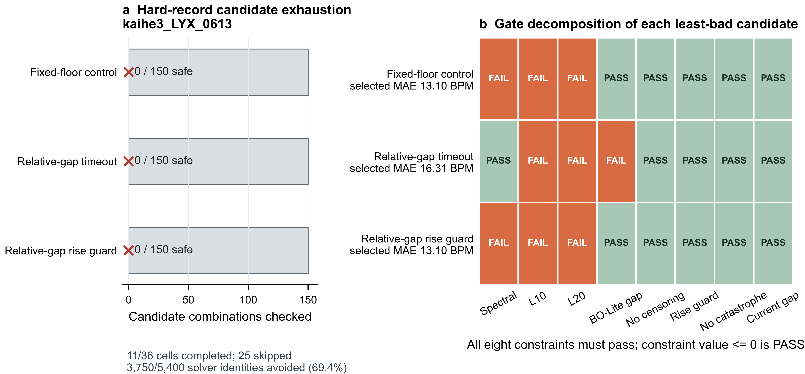

# LYX BO 空间泛化大实验最终报告

日期：2026-08-01
证据等级：`development_reuse_pilot`
最终状态：`terminal_no_safe_recovery_candidate`

## 结论

本轮没有在当前恢复机制与滤波空间中建立可稳定共享的参数机制。固定恢复、相对间隙超时恢复和相对间隙上升保护三个机制，在同一首要困难记录 `kaihe3_LYX_0613` 的 150 个唯一参数组合中均得到 `0/150` 安全候选。预注册短路规则因此淘汰全部恢复机制，Gate B 的四场景 12 折场景内选择器重放审计没有启动。

这个结论不是“共享参数一定不可行”。它更窄，也更有用：在 LYX 的四场景开发复用面板上，当前候选集无法同时满足频谱安全、长错误段、恢复和工程精度门槛，因此没有资格验证场景内共享参数。继续机械跑满原 36 个独立 BO 单元不能改变这一淘汰事实。

图 a 显示三个机制都在 `kaihe3_LYX_0613` 上完整检查了 150 个唯一组合，却没有得到安全候选。图 b 进一步说明零候选不是单一频谱门造成的：固定恢复和上升保护的最小 MAE 候选同时失败于频谱、L10 与 L20；超时恢复虽然通过频谱门，但仍失败于 L10、L20，并且相对独立 BO Lite 的 MAE 增量超过 2 BPM。三个机制因此不存在可进入共享选择器审计的“勉强胜者”。

## 研究问题与边界

本轮最终问题是：在同一个体 LYX、同一运动场景的三条开发记录之间，能否先冻结恢复机制，再从有限物理参数组合中稳定选择一组共享参数？

开发面板包含写字、敲键盘、跑步和开合跳四个场景，每个场景三条记录，共 12 条。全部记录都参与过机制开发，因此场景内“两条选择、一条揭示”只约束选择器的数据读取边界，不构成算法级留出、未见场景或迁移验证。主要工程精度锚点始终是每条记录各自的独立 BO Lite；`TraceRescue` 仅作为历史探索背景，不进入主要基线、胜负计数或结论排序。

## 实验路径

本轮先处理上一轮暴露出的恢复、滤波与惩罚耦合问题，再决定是否进入共享参数验证。主要证据链为：

1. Stage R 的阈值诊断与恢复哨兵筛选没有产生安全恢复候选，且旧频谱口径暴露出量纲问题；
2. 频谱量纲控制确认旧脉搏功率保留率存在尺度不一致，并将 before/after 修订到同一逐窗标准化域；
3. 修订后的 p25 频谱复验将脉搏功率保留恢复到合理量级，但三个预定义 p25 档位仍没有一个在 12 条记录上全部通过；
4. 滤波机制分解把局部频谱损伤定位到两个自适应参考级的串行组合，单级 rank-1 路径在 12 条记录上通过频谱门；
5. rank-1 修订与恢复重规划仍未产生可直接进入最终筛选的安全候选，因此经人工批准启动逐记录独立 BO 上限诊断；
6. 原 36 单元计划在固定恢复的第九个单元自然封存后停止，改为困难样本优先 Gate A；只有存在 `fs_target=25` survivor 时才允许执行 Gate B。

详细的上游结果分别见：[Stage R 停止结论](2026-07-30-lyx-stage-r-no-safe-decision.md)、[p25 修正量纲复验](2026-07-30-lyx-p25-spectral-recheck-result.md)、[滤波机制分解](2026-07-30-lyx-filter-mechanism-decomposition-result.md)与 [rank-1 滤波修订](2026-07-30-lyx-rank1-filter-revision-result.md)。最终短路规则见[预注册审计规范](../experiments/2026-07-31-lyx-recovery-short-circuit-selector-replay-audit-spec.md)。

## 结果

### 独立 BO 说明部分场景存在逐记录安全上限

固定恢复在停止前完成了 9 个单元，每单元检查 150 个唯一组合。敲键盘和跑步的六条记录均有安全候选；三条开合跳记录中，`kaihe1_LYX_0613` 与 `kaihe1_LYX_0617` 分别有 19 和 24 个安全候选，`kaihe3_LYX_0613` 为 0。这个结果说明参数空间并非整体无效，但安全上限具有明显的记录依赖性。

| 场景 | 记录 | 安全候选 / 150 | 冻结排序所选 MAE（BPM） |
|---|---|---:|---:|
| 敲键盘 | `jianpan1/2/3` | 7 / 25 / 60 | 2.614 / 2.620 / 1.582 |
| 跑步 | `run1/2/3` | 74 / 108 / 47 | 2.063 / 0.749 / 1.124 |
| 开合跳 | `kaihe1_0613/0617`, `kaihe3_0613` | 19 / 24 / 0 | 2.427 / 5.194 / 13.101 |

这些逐记录结果是样本内诊断上限，不是共享参数结果。尤其是 `kaihe3_LYX_0613` 的零候选意味着，固定恢复不可能通过包含该记录的开合跳场景共享审计。

### Gate A 淘汰全部恢复机制

Gate A 对剩余两个恢复机制沿用原 150 候选、原指标合同和原独立 BO Lite 锚点，并把 `kaihe3_LYX_0613` 冻结为第一困难单元。两个机制均在第一单元短路。

| 恢复机制 | 安全候选 | “最不坏”MAE（BPM） | 相对独立 BO Lite（BPM） | `fs_target` | 失败门 |
|---|---:|---:|---:|---:|---|
| 固定恢复对照 | 0 / 150 | 13.101 | +1.121 | 100 | 频谱、L10、L20 |
| 相对间隙超时 | 0 / 150 | 16.308 | +4.328 | 25 | L10、L20、独立 BO Lite 差距 |
| 相对间隙上升保护 | 0 / 150 | 13.101 | +1.121 | 100 | 频谱、L10、L20 |

表中的数值是每个全失败候选池中按冻结排序得到的最小 MAE 候选，不是合格结果。独立 BO Lite 对该记录的锚点为 11.980 BPM。相对间隙超时提供了一个重要的局部信号：`fs_target=25` 下可以通过频谱门，但恢复长尾仍不安全。相对间隙上升保护的最小 MAE 候选与固定恢复的参数、MAE和门结果相同，因此本轮没有观察到它在该困难记录上的可辨优势；这不证明两种实现处处等价。

### Gate B 按规则未执行

Gate B 的启用条件是至少一个恢复机制通过六个困难单元，并在每个单元拥有非零的 `fs_target=25` 安全候选。本轮两个待筛机制都在第一困难单元得到 0 个候选，固定恢复也已由同一记录预先淘汰。因此：

- survivor 数为 0；
- `fs_target=25` survivor 数为 0；
- 场景内选择器重放槽位完成数为 0 / 12；
- Gate B 状态为“按预注册停止规则不执行”，而不是“执行失败”或“缺少预算”。

在没有合格恢复机制时运行 12 折，只会在不可接受的候选中选择最小坏值，这与“无安全候选时必须停止”的实验合同冲突。

### 短路节省了不改变结论的计算

原计划为 36 个单元、5,400 个唯一求解身份。本轮实际封存 11 个单元、1,650 个求解身份，未运行 25 个单元，避免 3,750 个身份，占原计划的 69.4%。每个已完成单元均有 150 个求解身份、0 自动重试和 0 失败身份。

求解结束后出现的 `mappingproxy` JSON 序列化错误只影响 completion 写入。11 个单元均通过已批准的零运行修复补齐 completion 与成对回执，修复新增求解身份、solver 运行和重试均为 0。原始候选结果与种子稳定性审计未被重算。

## 讨论

### 对本轮目标的判断

当前证据不支持“已经实现 LYX 个体内、单一场景内稳定共享参数”。敲键盘与跑步的逐记录结果表明，容易场景中存在较宽的安全参数区域，目标并非没有希望；但共享机制必须先在每条记录上存在安全解，并通过不读取目标记录性能的选择器审计。本轮既没有跨过开合跳困难记录，也没有运行 Gate B，因此不能把逐记录候选重叠外推为稳定共享选择。

换言之，本轮成功完成了机制淘汰与实验路线收敛，但没有成功完成算法泛化目标。负结果把问题从“是否应该继续扩大 BO”收缩为“怎样让困难动态场景同时通过频谱与长错误段门”。

### 最没有把握的机制

最大不确定性不再是 `fs_target`、记忆长度和 `mu` 的覆盖范围，而是恢复状态如何在真实心率快速上升、运动伪影和运动后恢复之间切换。证据来自两条互补失败路径：

- 固定恢复与上升保护可以靠近独立 BO Lite 的 MAE，但仍同时失败于频谱、L10 和 L20；
- 相对间隙超时可以在 `fs_target=25` 保住频谱，却产生 42 个窗口的最长 E10、23 个窗口的最长 E20，MAE 也超过锚点 4.33 BPM。

这说明滤波安全与恢复及时性尚未解耦。下一轮若只扩大同一参数网格，最可能得到更多“频谱安全但长尾失败”或“MAE较低但频谱失败”的候选，而不是稳定机制。

### 是否继续完整独立 BO

不建议继续跑满当前 36 单元，也不建议在当前机制空间发起另一轮完整独立 BO。首个困难记录已对全部三个恢复机制给出 0 / 150，后续记录无法逆转其全记录资格。更多独立 BO 只能补充已淘汰机制在容易记录上的样本内上限，不能回答共享参数选择问题。

下一轮应先围绕 `kaihe3_LYX_0613` 做小体量、轨迹级的恢复状态诊断，优先解释超时恢复为何在频谱安全时仍保留长错误段，以及上升保护为何没有形成可辨收益。只有新机制在该记录上产生至少一个同时通过频谱、L10、L20和独立 BO Lite 差距门的 `fs_target=25` 候选，才值得恢复六困难单元 Gate A；Gate A 有 survivor 后再执行 Gate B。

## 下一轮实验入口

建议按以下顺序继续：

1. 在 `kaihe3_LYX_0613` 上冻结少量代表参数，做恢复触发、目标轨迹与错误段的时间对齐诊断，不运行全矩阵 BO；
2. 设计一个能把“频谱安全滤波”与“动态恢复状态”分开的最小恢复修订；
3. 先执行单困难记录的安全性预检，再恢复六记录 Gate A；
4. 只有 `fs_target=25` survivor 出现后，执行四场景 12 折 Gate B；
5. Gate B 达到开发参考线后，启用已冻结的[波比跳未见场景挑战移交包](../experiments/2026-08-01-lyx-next-unseen-scene-challenge-handoff.md)；
6. 未见场景通过后，再由 Issue #13 进入跨个体实验。

## Issue 处置

| Issue | 最终处置 |
|---|---|
| #102 | 原 `8×12` 完整滤波矩阵被用户批准的困难样本短路设计取代，不将未运行矩阵伪装为完成 |
| #104 | 原三惩罚完整交互与再次回滚被短路路线取代；恢复、滤波和惩罚耦合由机制分解、rank-1 修订与 Gate A 共同约束 |
| #105 | 因 Gate A 无 survivor，按预注册规则关闭为“不执行 Gate B”，不伪造 12 折 completion |
| #106 | 本报告、当前独立 BO 判断与未见场景挑战移交包均已落盘 |
| #13 | 保持开放，承接未来跨个体验证，不属于本轮完成条件 |

## 可复核产物

- Gate A completion：`bc8d6344e5a84236c78286f68b0b97d894ce0403dd6c6c9b25563795ab207c19`
- 短路 proposal：`00636769dd50b790af22a9b25101c4024fc682effaca740ac1d091c5d9739f10`
- 直接调用栈零运行修复 proposal：`870e14074339a73a4dc877bb72e25a965c9dbb6565e050e113b731f118037c53`
- 最终结构化摘要：`ae0c4a8b5dbba9a0218f88dc410bbb8a06ad2410b8671bd7fc1d95e7cb19f148`
- 波比跳挑战移交合同文件：`ec14be0011123ccd4b4048d61522766520f8ba114c8619f3ce9ce6b89950885c`
- [逐机制结构化指标](assets/2026-08-01-lyx-bo-space-generalization-final/lyx_short_circuit_final_metrics.csv)
- [机器可读最终摘要](assets/2026-08-01-lyx-bo-space-generalization-final/lyx_short_circuit_final_summary.json)
- [机器可读波比跳挑战移交包](../experiments/2026-08-01-lyx-next-unseen-scene-challenge-handoff.json)
- [SVG 矢量图](assets/2026-08-01-lyx-bo-space-generalization-final/lyx_short_circuit_final.svg)
- [PDF 矢量图](assets/2026-08-01-lyx-bo-space-generalization-final/lyx_short_circuit_final.pdf)

## 术语与声明边界

| 术语 | 本报告中的固定含义 |
|---|---|
| 独立 BO Lite | 每条记录单独使用参考心率得到的工程精度锚点 |
| 安全候选 | 同时通过八项逐记录约束的参数组合 |
| Gate A | 按冻结困难记录顺序运行、首个 `0/150` 即淘汰的恢复机制短路筛选 |
| Gate B | 只有 `fs_target=25` survivor 才能进入的场景内选择器重放审计 |
| 开发复用 | 同一批记录参与过机制和规则开发，不构成算法级留出 |
| TraceRescue | 历史探索算法，不是本轮主要基线 |

本报告不声称未见记录、未见场景、跨日期、跨佩戴或跨个体泛化。它只说明当前恢复候选集在 LYX 开发复用面板的首要困难记录上没有安全参数上限，因此本轮共享参数机制未被验证。
