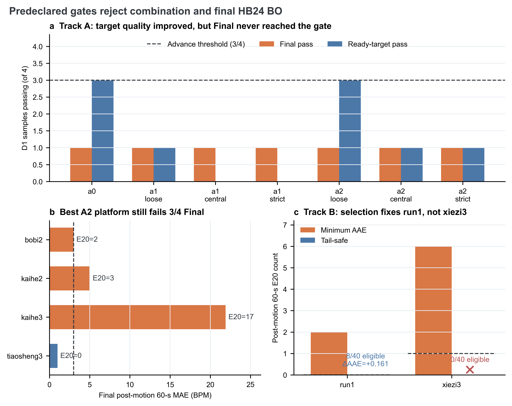

# 交接 reset 可观测性恢复与 BO 尾段安全实验报告

## 一句话结论

本轮证明了“可观测性恢复后一次性重启交接 reset”能够保护独立 FFT、恢复高质量交接目标且不损害正常样本，但它不能修复可观测性恢复前的 Final 误差；同时，尾段安全选择只能修复 `run1`，无法从 `xiezi3` 的既有 40 个 Lite trial 中选出安全结果，因此 Track A 与 Track B 均为 `NO_GO`，不进入组合、YZY 冻结评估和 HB24 最终 BO。

## 术语口径

| 术语 | 本报告中的固定含义 |
|---|---|
| 独立 reset FFT | 不读取切换前 Final 的纯 PPG 对照链路；本轮逐窗数值保持不变 |
| 交接 reset FFT | 允许读取切换前 Final 及下降趋势弱先验、供 adaptive 退出后 Final 消费的 FFT 链路 |
| 可观测性恢复 | 完整运动后窗口的 PPG 周期性、峰竞争和跨窗连续性达到因果门槛 |
| target ready | 交接目标已通过独立 raw 证据确认，可供 `gap_rescue` 或 `stable_crossover` 消费 |
| 尾段安全选择 | 先排除运动后 60 秒 E20 超过旧基线的 trial，再在合格 trial 中最小化原全段 AAE |

## Track A：交接 reset 机制

### 观察结果

冻结 N5 输入后，A0、A1 和 A2 的独立 reset 逐窗完全一致，正常样本没有出现新增硬失败。A2 的宽松预声明配置在 `bobi2`、`kaihe2` 和 `tiaosheng3` 上均得到 MAE 不高于 3 BPM、E20 为 0 的 ready 后交接目标；一次性重启次数均为 1。与 A1 相比，A2 能复用可观测性恢复时缓存的好窗口，更早形成 ready，说明清除初期低锁历史具有真实机制收益。

但固定运动后 60 秒 Final 仍只有 `tiaosheng3` 一条达到 MAE 不高于 3 BPM且 E20 为 0。`bobi2` 的 2 个 E20、`kaihe2` 的 3 个 E20 都发生在可观测性恢复和 target ready 之前；`kaihe3` 在 20 秒截止前没有足够证据，按设计安全弃权。最优平台的 D1 Final 通过数仍为 1/4，低于 3/4 晋级门槛。

### 机制解释

新机制解决的是“坏 PPG 窗口污染交接 tracker”问题，而不是“运动刚结束时归档 Final 本身错误”问题。PPG 尚不可观测时，如果为了消除早期 E20 而允许交接目标被消费，就必须放宽当前最重要的安全边界；现有 raw-only 证据不能可靠区分真实心搏与稳定运动伪峰。因此，早期 E20 与安全门控之间存在真实约束，不应通过降低阈值或复制参考答案来回填。

### Track A 决策

`NO_GO`。保留 A2 作为有证据支持的研究候选，但不能称为已通过 Final 门槛，更不能默认并入主算法。由于 Track A 未通过，YZY 只评估门控未打开；这不是 YZY 样本通过或失败的结论。

## Track B：BO 尾段安全

### 固定实验条件

交接 reset 完全关闭；对 `run1`、`xiezi3`、`run2` 和 `xiezi2` 分别重放 N5 已产生的同一组 40 个参数点。搜索空间、预算和单次 solver 行为不变。参考心率只在离线误差计算和最终 trial 选择中使用，不进入运行时追踪。

### 观察结果

| 样本 | 旧基线 E20 | 最低 AAE trial：AAE / E20 | 安全 trial：AAE / E20 | 合格 trial | 归因 |
|---|---:|---:|---:|---:|---|
| run1 | 0 | 3.463 / 2 | 3.623 / 0 | 8/40 | objective/selection 冲突 |
| xiezi3 | 1 | 16.449 / 6 | 无 | 0/40 | 当前搜索/求解能力不足 |
| run2 | 9 | 7.410 / 9 | 同最低 AAE | 39/40 | 已安全 |
| xiezi2 | 7 | 17.889 / 7 | 同最低 AAE | 40/40 | 已安全 |

`run1` 证明预声明协议本身有价值：只付出 0.161 BPM 的全段 AAE 代价即可消除新增 E20。两条正常对照不需要换 trial，说明该规则没有为了尾段安全机械地牺牲所有样本的全段最优结果。

`xiezi3` 则证明只改“最后选哪个 trial”还不够。其 40 个 trial 没有一个达到旧基线 E20 不高于 1；如果在这种情况下仍返回最低 AAE trial，就会违反 fail-closed 约定。该失败不能归咎于交接切换，也不能通过尾段选择层掩盖。

### Track B 决策

`NO_GO`。尾段非回归协议实现应保留，因为它能阻止 `run1` 类型的可避免选择失败，并在无安全 trial 时明确报错；但它不能被描述为已经解决 BO 尾段风险。`xiezi3` 需要下一轮研究 Lite 搜索空间或单次 solver 对运动后低频锁定的表达能力。

## 支持保留的设计

1. 独立 reset 与交接 reset 两条曲线继续分离，独立 FFT 不做重新初始化。
2. 完整运动后窗口、PPG 周期性、峰竞争与跨窗连续性共同定义可观测性，不用单一振幅门槛。
3. 只在首次可观测性恢复时对交接 reset 做一次重启；后续质量下降撤销 ready，但不反复重启。
4. `gap_rescue` 保持 ready 后硬切，`stable_crossover` 保持 ready 后非硬切；两者都不能绕过可观测性与 target ready。
5. BO 历史保存每个 trial 的固定运动后 60 秒 E20；尾段安全策略先做 E20 非回归，再比较原全段 AAE，并在无合格 trial 时 fail closed。

## 下一轮建议

下一轮不应继续调 A1/A2 的周期性或竞争阈值，也不应启动 #57/#58。优先对 `xiezi3` 做 solver 级归因：比较 40 个 trial 的时间偏置、平滑、LMS 和谱惩罚参数与尾段低频锁定的关系，确认安全候选缺失究竟来自搜索空间未覆盖，还是所有现有参数共享同一追踪状态缺陷。只有先产生至少一个 E20 不超过旧基线的候选，尾段安全选择协议才有可消费对象。

如果后续需要扩展搜索空间，应另立实验并保持以下边界：不把参考心率带入在线 solver，不用 `xiezi3` 单样本直接挑单点参数，不与交接 reset 同时调优，并继续使用正常对照检查全段性能和尾段非回归。

## 验证与证据边界

- 本轮定向测试：97 项通过。
- 项目全测：623 项通过、44 项因外部数据缺失跳过、7 项因工作树没有旧窗口诊断 fixture 而在 setup 阶段报错；按已确认的基线限制未复制这些无关 fixture。
- Track A 只使用已见 HB 冻结开发数据；Track B 只重放已见 N5 trial。两者都不是跨个体泛化证据。
- 未执行 YZY 冻结评估、Track A/B 组合、单样本最终 smoke 或 HB24 Lite BO `1×40`。这些动作被前置 `NO_GO` 门控明确阻止。

源数据见 [source_data.csv](source_data.csv)，绘图代码见 [make_figure.py](make_figure.py)。完整逐 trial 和逐窗口产物保存在对应批量输出目录中。
