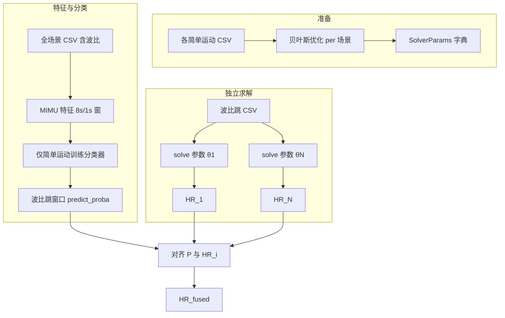

# MIMU 加权融合心率估计算法设计说明

本文档固化「简单运动参数 + 运动模式分类 + 输出层加权融合」研究方案的**算法定义、假设边界、数据契约与评估口径**，供实现 notebooks 或工程代码时对照。内容与仓库内 `ppg_hr` 求解器语义一致。

---

## 1. 问题与目标

**输入**：复杂运动（如波比跳）的 PPG + IMU 原始序列；各简单运动场景在**各自数据**上经贝叶斯优化得到的 `SolverParams` 集合。

**输出**：复杂运动序列上的融合心率估计 \(HR_{\mathrm{fused}}(t)\)，并与多种基线比较 **AAE（平均绝对误差，BPM）** 等指标。

**目标**：验证假设——在 MIMU 特征空间中用分类器给出「当前窗口更像哪种简单运动」的软分配，再对多条独立求解的心率曲线加权，能否优于单组妥协参数或简单平均。

---

## 2. 核心假设

1. **组合假设**：复杂运动在时间上可近似为多种简单运动模式的组合；每个分析窗口在特征空间上可用「属于各简单运动类别」的概率向量描述。
2. **参数可迁移**：在纯简单运动数据上优化得到的 `SolverParams`，用于整条复杂运动序列的独立完整求解时，仍能提供**有差异的**心率轨迹，供后续加权。
3. **软分配有用**：若分类器给出的窗口级分布 \(P(t)\) 与真实运动阶段相关，则 \(\sum_i P_i(t)\,HR_i(t)\) 应能带来比均匀权重更合理的融合。

以上均为**经验性假设**，需在「特征可分性」「分类器行为」「融合相对基线增益」上分别验证。

---

## 3. 方法边界（必须写进结论口径）

### 3.1 融合发生在输出层，不是在线切换滤波器状态

心率求解器内部使用 LMS/KLMS/Volterra 等**有状态**自适应滤波与递推。本方案**不在时刻 \(t\) 切换滤波器内部状态或系数**。

正确做法是：

- 对同一组原始数据，用参数集 \(\theta_i\)（\(i=1,\ldots,N\)）**各自完整运行**求解器，得到 \(N\) 条心率序列 \(HR_i(t)\)；
- 在**公共时间轴**上，用分类器输出的 \(P_i(t)\) 做凸组合：

\[
HR_{\mathrm{fused}}(t) = \sum_{i=1}^{N} P_i(t)\, HR_i(t), \quad \sum_i P_i(t)=1,\ \ P_i(t)\ge 0
\]

（实际实现中在离散采样点上计算，必要时对 \(P\) 与 \(HR_i\) 做插值对齐。）

因此：这是**多条独立解的后验融合**，不是「单条轨迹上按类切换参数」的物理最优。

### 3.2 简单运动最优参数 ≠ 复杂运动中「同名片段」的真子问题

\(\theta_i\) 在**纯第 \(i\) 类运动数据分布**上优化；波比跳中「被判为第 \(i\) 类」的窗口，其 PPG 与运动干扰谱仍与纯采集条件不同。结论应表述为**经验改进**，避免过度因果解释。

### 3.3 搜索空间离散与参数多样性

贝叶斯优化在离散网格上搜索（见 `python/src/ppg_hr/optimization/search_space.py`）。不同简单运动的全局最优 \(\theta_i\) 可能接近，导致 \(HR_i(t)\) 高度相关，**加权相对均匀平均的增益**可能被压缩。评估时应报告**单参数 HR 曲线之间的相关性**（如 Pearson 相关矩阵），以判断「可分的融合空间」有多大。

---

## 4. 与求解器一致的时间轴约定

以下与 `python/src/ppg_hr/core/heart_rate_solver.py` 中主循环一致：

- 滑动窗长度 **8 s**，步长 **1 s**（`win_len_s=8`, `win_step_s=1`）。
- `HR[:, 0]` 为**当前窗口起点时间**（秒），从 `time_start`（默认 1.0 s）起递增。
- 特征提取 notebook 若使用「起点对齐」的窗口（例如从 `Time_s` 的窗口起点取 `window_time`），与 `HR[:,0]` **同一语义**，便于与 \(P(t)\) 对齐。

若分类器与 MIMU 特征使用相同 8 s/1 s 网格，则窗口索引与求解器输出窗口**一一对应**；若时间戳来自不同起点，需显式插值到公共网格并归一化概率（行和为 1，避免数值误差）。

---

## 5. 端到端流水线

**步骤摘要**：

1. **参数汇总**：从各场景 `batch_outputs/**/*-best_params.json`（或旧式 `Best_Params_Result_*.json`）读取，为每个简单运动类保留 HF 路径最优的 `best_para_hf`，并转为 `SolverParams`（见第 8 节）。
2. **特征**：每窗 8 s、步 1 s、100 Hz，提取约 75 维 MIMU 特征；可做 PCA/t-SNE 门控「简单运动是否可分」。
3. **分类器**：仅使用**简单运动**窗口训练；输出波比窗口的 \(P(\text{类} \mid \text{窗})\)。推荐主模型为 Random Forest 的 `predict_proba`。
4. **独立求解**：对每个 \(\theta_i\) 在**整条**波比序列上调用 `solve_from_arrays`（或等价 API），得到各 \(HR_i\)。
5. **对齐与融合**：将 \(P\) 与各 \(HR_i\) 插值到公共时间网格，计算 \(HR_{\mathrm{fused}}\)；可选对 \(P\) 做行归一化与 clip。

---

## 6. 多文件波比数据时的数据契约（关键）

当存在多个波比 CSV 时，分类器输出必须带**文件级索引**（例如 `burpee_meta["files"]` 与 CSV `stem` 一致）。

**错误做法**：把多个文件的窗口概率与时间戳**拼接**成一个大数组，再只对**其中一个文件**跑求解器并用 `interp1d` 对齐——会出现**同一时间戳重复对应不同概率**的问题，融合权重整体错误。

**正确做法**：对每个 `波比 CSV`：

- 取 `mask = (files == 当前 stem)`，只对子集 \(P\)、\(t\) 与当前文件求解得到的 \(HR_i\) 做对齐与融合；
- 或循环每个波比文件分别保存一套 `fusion_results`，再汇总跨文件 AAE。

---

## 7. 分类器验证与数据泄漏

简单运动同一 CSV 内相邻 8 s 窗（步长 1 s）**高度重叠**，若使用随机或分层 K 折交叉验证而不按文件分组，会把**同一文件的近似重复窗**同时分到训练集与验证集，导致准确率虚高。

**推荐**：对训练集使用 **`GroupKFold`（或 `LeaveOneGroupOut`）**，`groups` 为 `file_name`（或等价会话 ID）；折数不超过不同文件个数。

---

## 8.「直接优化」基线与 CSV 对齐

波比场景贝叶斯优化可能产生**多个样本**（多个 CSV 或多组 batch 运行）。评估某条波比文件时，`min_err_hf` 应对**该文件对应优化记录**比较，而不是全局取 min 的一条记录。

**推荐数据结构**：

- `burpee_baseline_by_sample: dict[stem, optimization_record]` — stem 与数据 CSV 文件名一致（不含扩展名）；
- 评估时：`baseline = burpee_baseline_by_sample.get(current_stem) or global_fallback`。

---

## 9. `best_para_hf` → `SolverParams` 解码

优化结果 JSON 中 `best_para_hf` 为离散网格解码后的字典，可能包含与策略相关的字段（如 `klms_step_size`、`volterra_max_order_vol` 等）。

**推荐**：以 `SolverParams` 的 dataclass 字段名为准，对 `best_para_hf` 中出现的、且属于求解器可调字段的键**全部写入**，避免仅手写部分 LMS 字段导致 KLMS/Volterra 结果丢失回退为默认值。

---

## 10. 基线与消融

| 名称 | 定义 |
|------|------|
| 加权融合 | 窗口级 \(P(t)\) 与 \(HR_i(t)\) 对齐后的 \(\sum_i P_i HR_i\) |
| 均匀平均 | \(\frac{1}{N}\sum_i HR_i(t)\)，不使用分类器 |
| 单参数 \(i\) | 仅 \(HR_i(t)\) |
| 默认参数 | 未优化的 `SolverParams()` 整条求解 |
| 直接优化 | 波比数据上贝叶斯优化的 `min_err_hf`（**按当前文件 stem 对齐记录**） |

**消融示例**：

- **全局分布**：用所有窗口的 \(\bar P = \text{mean}_t P(t)\) 代替逐窗口 \(P(t)\)，检验「细粒度分解」是否必要。
- **参数多样性**：报告 \(HR_i\) 两两 Pearson 相关矩阵。

**统计**：同一对象上的成对误差（如逐窗绝对误差）可用配对 Wilcoxon；需说明多重比较与效应量（如 Cohen’s d）仅作辅助。

---

## 11. 指标与阶段划分

- **AAE**：对参考 BPM 与预测 BPM 逐点取绝对误差再平均；可按求解器 `motion_flag` 拆 **运动 / 静息** 子集。
- 与 `ppg_hr` 中 `err_fus_hf` 等全局指标对照时，注意优化目标是在**整条序列**上定义的标量，与窗口级 AAE 的口径可能不同，需在报告中区分。

---

## 12. 实现检查清单（对话中确定的修复项）

| ID | 内容 |
|----|------|
| P0 | 多波比文件时：按 `stem` 筛选分类器概率与时间，**禁止**多文件混叠后对单文件求解器输出插值 |
| P1 | 分类器 CV 使用 **GroupKFold（按文件）**，避免重叠窗泄漏 |
| P2 | `burpee_baseline_by_sample` 与当前评估 CSV **stem 对齐** |
| P3 | `best_para_hf` → `SolverParams` **全字段**解码（含策略专属参数） |

---

## 13. 参考文献（代码内）

- 求解器主循环与 `HR` 列含义：`python/src/ppg_hr/core/heart_rate_solver.py`
- 离散搜索空间：`python/src/ppg_hr/optimization/search_space.py`
- 参数类：`python/src/ppg_hr/params.py` 中 `SolverParams`

---

## 14. 修订记录

| 日期 | 说明 |
|------|------|
| 2026-04-21 | 初版：根据研究方案评审与 P0–P3 实现约定整理 |
| 2026-04-21 | P0–P3 全部实施：GroupKFold、按 stem 筛选/基线、全字段解码；数据路径迁移至 data/ |
