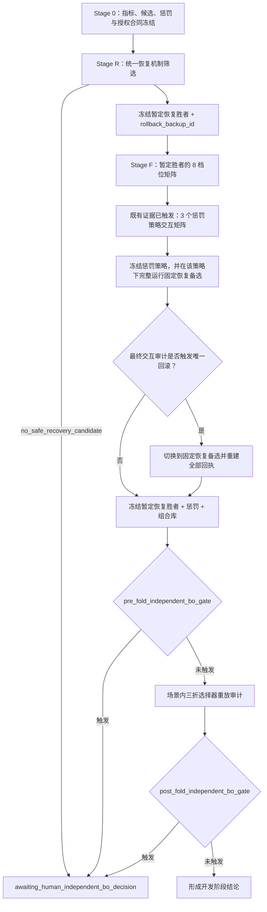

# LYX 恢复机制与跨场景滤波组合库实验设计

> 状态：独立风险审阅后完成一轮设计闭环；仅完成文档，不进入实现或实验执行。  
> 日期：2026-07-28  
> 数据边界：LYX 单个体、开发复用数据  
> 主要工程精度锚点：每条记录的历史独立 BO Lite  
> 公平机制对照：同 commit、同组合库、同折角色下的当前机制  
> 人工审核节点：完整新求解器独立 BO

## 1. 目标与证据边界

本轮先解决上一轮暴露出的机制耦合问题，使一套统一恢复机制和一个小型、预定义的滤波组合库在 LYX 的多个运动场景内表现稳定。目标不是立即证明跨场景或跨个体泛化，而是形成可冻结、可解释、计算量受控的机制与选参流程，为下一轮未参与开发的场景验证和后续跨个体验证提供候选。

本轮所有 12 条记录都会影响恢复候选、滤波组合库边界或惩罚策略，因此任何一条记录都不是整套算法开发流程的真正留出数据。后续三折只能表述为“全体开发数据条件下的场景内选择器重放审计”：它检查冻结档位选择规则在折内是否直接读取目标记录，不能证明恢复机制、组合库或整套算法已经迁移成功。

整套冻结流程的首次迁移验收必须移至下一轮未参与本轮开发的挑战场景。即使本轮三折严格执行折内读取屏障，也不得写成未见记录、未见场景、未见个体或确认性泛化通过。

## 2. 已冻结的设计决策

1. 机制开发面板固定为 4 个场景、每场景 3 条记录：
   - 写字 `xiezi`
   - 敲键盘 `jianpan`
   - 跑步 `run`
   - 开合跳 `kaihe`
2. 波比跳及其他 LYX 场景不参与本轮机制开发，保留为下一轮挑战场景。
3. 恢复机制在四个场景间统一，不允许按场景调恢复规则。
4. 滤波侧收缩为最多 8 个预定义组合，最终采用全枚举，不再在组合库内运行 BO。
5. 每折只用同场景两条折内训练记录选择一个场景共享滤波档位，随后原样应用于折内审计目标记录；该记录不是算法开发层面的真正留出数据。
6. TraceRescue 仅作为历史探索来源，不作为本轮主要基线，也不进入正式优劣排序。
7. 每条记录历史独立 BO Lite 保持为主要工程精度锚点；另设同 commit、同组合库、同折角色的当前机制作为公平因果对照。旧 K3 共享结果仅作为失败诊断证据。
8. 恢复、滤波与惩罚采用“两遍冻结 + 最多一次证据触发回滚”，禁止循环联合调参。
9. 完整新求解器独立 BO 不是默认步骤，必须经过人工审核。

## 3. 本轮不做的事项

- 不在波比跳、跳绳、拳击、卧立等其他场景上验证。
- 不作跨个体实验。
- 不把平滑时长重新并入搜索。
- 不运行样本级多候选在线切换，也不把新方法并入 TraceRescue。
- 不以样本内最佳档位代替场景共享选择结果。
- 不因某个候选平均 MAE 较低而绕过长尾安全门槛。
- 不自动启动完整新求解器独立 BO。

## 4. 研究问题与预期判断

### 4.1 恢复机制

能否用跨场景统一的相对频谱证据和恢复超时/失败退出规则，替代对固定绝对 BPM 下界的依赖，并同时：

- 解除写字、键盘中错误高频轨迹的持续锁定；
- 不压制跑步、开合跳中的真实生理性心率上升；
- 避免保护带、历史状态或惩罚项持续维护错误轨迹。

### 4.2 滤波组合库

能否用最多 8 个跨场景覆盖型组合，覆盖 `fs_target`、物理记忆长度和有效 `mu` 的主要稳定区域，使场景共享选出的档位接近单记录独立 BO Lite 工程精度锚点，同时相对同角色当前机制对照避免上一轮 K3 的灾难性尾部失效。

### 4.3 机制耦合

恢复机制的结论是否会因滤波组合改变而反转；如反转，是否能用一次受控回滚修正，而无需恢复、滤波、惩罚三者联合 BO。

## 5. 比较层级

正式报告必须按以下层级呈现，不能混称：

1. **历史独立 BO Lite**：用户指定的主要工程精度锚点；它使用被测记录自身参考答案选参，只表示样本内拟合上限，不进入“可迁移性胜负”或恢复机制因果归因。
2. **同身份恢复机制 A/B**：同一 commit、同一历史参数分别重放当前恢复机制与新恢复机制，只有配对差值 `new - current` 可以归因于恢复机制变化；历史归档轨迹只作外部精度锚点。
3. **同角色当前机制对照**：当前恢复/惩罚机制与新方案使用完全相同的最多 8 个组合、折内训练/审计角色、选择规则和评价合同。这是本轮判断机制改动是否产生开发内收益的公平因果对照。
4. **组合库样本内上限**：每条记录在最多 8 个档位中的诊断最佳值，只回答组合库覆盖问题。
5. **场景共享滤波档位重放**：每折仅依据两条折内训练记录选择，在折内审计目标记录上重放；这是本轮实际工程结果，但不是整套流程的迁移验证。

上一轮旧 Lite 场景三折结果只有在数据角色、solver 身份、平滑、指标合同和候选覆盖完全一致时才能作为补充公平基线复用；任何身份不一致都必须明确标为历史背景，不得冒充本轮公平对照。若未来要新跑完整旧 Lite 场景三折，应单列计算预算和人工批准，不得隐含在本轮流程中。

TraceRescue 可以在背景中解释设计来源，但不得出现在主要基线表、胜负计数或结论性排序中。旧 K3 结果只用于说明为何需要修复，不作为新方法应追逐的性能目标。

## 6. 总体流程



## 7. Stage 0：运行前口径冻结

### 7.1 正式基线重新对齐

现有诊断 JSON 中的 MAE、`E10/E20` 长尾统计可用于设计，但不能直接充当正式验收基线。执行前必须依据 `lyx_recovery_profile_metric_v1` 重新生成历史独立 BO Lite、同身份机制 A/B 和同角色当前机制对照的逐记录：

- 严格运动段 MAE；
- `|error| >= 10 BPM` 的最长连续窗口数 `L10`；
- `|error| >= 20 BPM` 的最长连续窗口数 `L20`；
- 恢复延迟；
- 可用窗口数及排除原因。

尤其要先确认 `kaihe3` 的历史结果，因为现有不同报告口径下 MAE 不一致。本轮只采用重新对齐后的正式回执。

`lyx_recovery_profile_metric_v1` 继承 `lyx_bo_formal_metric_v1` 的下列失败关闭合同：

- `HR` 与 `window_table` 按 `window_idx` 一一连接，`center_s` 差值不超过 `1e-9 s`；
- 固定 `smooth_win_len=5`、`time_bias=5.0 s`，并声明平滑和参考对齐包含离线未来依赖；
- `t_aligned=center_s+time_bias`，参考心率只在原始参考时间线上插值；
- `base_motion` 要求参考时间重叠、参考值有限、`window_table.reliable=true` 且 `HR.is_motion>=0.5`；
- 至少 10 个 `base_motion` 窗口，所有被评价曲线在这些窗口上 100% 有限；
- 保存窗口数、共同窗口数、时间戳 SHA-256；缺行、重复、非有限、哈希或掩码不一致均失败关闭。

长尾统一采用包含边界的定义：

```text
E10 := |error| >= 10 BPM
E20 := |error| >= 20 BPM
```

`L10/L20` 按连续 `window_idx` 计算；缺窗或相邻中心时间超过一个窗口步长即中断连续段，无事件时为 0。

恢复延迟采用离线统一定义，不作为运行时触发信息：每个 E10 episode 从首个 E10 窗口开始，恢复点为此后首个连续 3 窗满足 `|error| < 10 BPM` 的序列起点，延迟为两者中心时间差。记录结束仍未恢复者标记 `right_censored_recovery=true`，资格判断按恢复失败处理，排序时劣于任何已恢复候选，禁止删除。

真实上升压制同样是离线验收指标。`physiological_rise_episode` 定义为 `base_motion` 中至少连续 10 个窗口、参考心率从首窗到段内峰值上升至少 `15 BPM`，且逐窗参考差分中位数大于 0 的最大连续段。每段计算 `rise_underestimate=median(ref_aligned-final_bpm)`；无符合段的记录标为 `not_applicable`，不得以 0 代替或进入该指标平均。

### 7.2 身份与缓存隔离

任何求解机制、运行策略、滤波实现、惩罚策略或评价口径变化都必须产生新的 solver/config/evaluation 身份。历史缓存只作为设计证据或在身份完全一致时复用，不能覆盖原归档，也不能让旧结果冒充新机制重放结果。

### 7.3 数据角色隔离

每次场景内三折选择器重放必须写出数据角色清单。即使某条折内审计目标记录的档位枚举结果已经存在于缓存，选择器也不得读取其性能字段。每折必须生成选择回执，列明：

- 两条训练记录；
- 一条折内审计目标记录；
- 选择器实际读取的文件及字段；
- 候选资格淘汰原因；
- 最终档位及完整排序键。

该读取屏障只保护折内档位选择器。由于恢复候选、组合库和惩罚策略均已使用全体 12 条开发记录，回执必须显式写入：

```text
algorithm_level_holdout = false
evidence_class = development_replay_audit
```

不得用“选择器没有读取目标记录”推导“整套算法没有使用目标记录”。

### 7.4 恢复候选注册表

首次正式求解前必须冻结 `recovery_candidate_registry`：

- 最多 3 个正式机制，含当前 control 和最多 2 个新候选；
- 每项记录完整公式、全部常数、状态转移、确认窗口、退出、超时、冷却和保护规则；
- 记录代码、配置和注册表哈希；
- 固定逐记录硬门、跨记录聚合、字典序排序、平局规则与 `no_safe_recovery_candidate` 停止状态。

固定 BPM 下界扫描属于单独的预注册诊断矩阵，不得从扫描结果继续生成未登记变体。注册表冻结后不得新增、合并或修改正式候选；任何修改均开启新的开发周期和新身份。

本 spec 生效后，任何使用 12 条开发记录产生的新 solver/config/record 结果，无论标记为 exploration、diagnostic 或 formal，均进入 `attempt_registry` 和计算预算。预算外设计只能读取本 spec 生效前已经存在的归档证据，不得产生新求解轨迹。

默认 `exploration_registry` 的新增求解预算为 0。若实施前确有必要运行新的探索计算，必须先冻结探索候选数、完整身份公式、记录范围和数字预算，并由人工批准预算修订；所有实际测试变体都要登记。未登记的探索结果不得用于提名正式恢复候选、滤波档位或惩罚策略。

### 7.5 频谱资格合同

首次正式求解前必须冻结 `spectral_gate_contract_v1`。对每条记录先在窗口内计算，再做记录内等权汇总，禁止跨记录池化窗口：

- `visible_top3`：参考心率 `±10 BPM` 内候选进入未惩罚 Top-3；
- `prominence_db`：该邻域最强峰功率相对邻域外最强竞争峰功率的 `10*log10` 比值；
- `hr_band_share`：参考邻域功率占 `30–210 BPM` 分析带总功率的比例；
- `pulse_power_retention`：滤波后参考邻域功率相对滤波前的比例；
- `residual_artifact_corr`：滤波残差与主运动参考在冻结时延规则下的绝对相关。

相对同角色当前机制对照，每条折内训练记录必须同时满足：

```text
median(prominence_db_delta) >= -0.5 dB
visible_top3_rate_delta >= -0.05
median(hr_band_share_delta) >= -0.02
median(pulse_power_retention) >= 0.80
median(residual_artifact_corr_delta) <= +0.05
```

任一指标无法计算、窗口不足，或 `median(pulse_power_retention)<0.80` 均失败关闭。这些门槛用于排除频谱伤害，不声称候选已经产生实际频谱增益；增益另以完整效应分布报告。

### 7.6 既有证据触发惩罚审计

上一轮正式诊断已观察到 `xiezi3` 的大量 E10 窗口发生真实峰被惩罚移除，并发现惩罚宽度与滤波参数耦合。因此 Stage 0 固定：

```text
penalty_trigger_decision = triggered_by_prior_evidence
```

不得等看到本轮三折结果后再决定是否研究惩罚，也不得把已经存在的置信度缩放、条件谐波惩罚或挑战峰保护抑制包装成新贡献。

### 7.7 预执行冻结门

正式求解开始前必须同时存在并校验以下哈希：

- `metric_contract_hash`
- `spectral_gate_contract_hash`
- `recovery_candidate_registry_hash`
- `recovery_selection_contract_hash`
- `penalty_registry_hash`
- `filter_profile_design_rule_hash`
- `budget_contract_hash`

任一缺失或不匹配，流程失败关闭。参数数值只能从既有归档证据形成，或从已经注册并计费的探索阶段形成。一旦任一新增求解结果产生，上述合同不得依据结果修改；任何变更均须开启新开发周期。

## 8. Stage R：统一恢复机制筛选

### 8.1 固定下界只作诊断扫描

对 `candidate_min_bpm = 85/80/70/60/50` 的扫描只用于定位绝对阈值敏感性，固定使用一个预注册锚点滤波档位，最多 `5×12=60` 条诊断轨迹。`50 BPM` 是诊断端点，不得因局部改善直接晋级为生产候选，也不得从扫描中继续派生额外阈值。

### 8.2 可晋级的机制方向

生产候选必须以相对证据为核心，并包含恢复超时或失败退出。候选应显式回答：

- 较低或较高挑战峰相对当前轨迹是否持续占优；
- 当前轨迹是否出现与频谱、运动阶段或候选稳定性不一致的持续证据；
- 进入恢复后，在规定窗口内未获得新轨迹支持时如何退出；
- 冷却、保护和连续确认如何避免来回跳变；
- 跑步和开合跳的真实上升如何不被误判为伪峰。

不得使用参考心率、离线误差或另一个算法的输出作为在线触发证据。

### 8.3 筛选规模

- 保留当前机制作为 control。
- 正式注册表最多容纳 2 个新恢复候选并保留全部正式候选身份；所有探索、诊断和正式运行另统一进入 `attempt_registry`。
- 每个候选在 3 个滤波哨兵档位上覆盖全部 12 条记录。
- 上限为 `3 个恢复机制 × 3 个哨兵 × 12 条记录 = 108` 条轨迹。

三个滤波哨兵应覆盖保守、中间和激进的频谱证据条件；其精确参数只有在 LMS 稳定性审计后才能冻结。恢复机制必须根据四场景整体证据晋级，不允许分别给场景选恢复规则。

正式恢复机制的晋级顺序固定为：

1. 淘汰任一记录违反 `L10/L20`、MAE、恢复失败或真实上升压制硬门的候选；
2. 淘汰在跑步或开合跳中制造新右删失恢复事件的候选；
3. 对剩余候选按“最差 `L10`、右删失事件数、最差恢复延迟、最差 MAE、平均 MAE、机制复杂度、candidate_id”做字典序排序；
4. 第一名记为 `provisional_recovery_id`，第二名固定为 `rollback_backup_id`；control 与新候选按同一规则竞争，不另设人工保送；
5. 无候选合格时输出 `no_safe_recovery_candidate` 并停止；只有一个候选合格时 `rollback_backup_id=null`，后续一旦满足回滚触发条件即进入 `awaiting_human_interaction_decision`，不得自动回滚到不合格候选。

`rollback_backup_id` 冻结后不得因完整矩阵表现另换第三个候选。它是唯一允许回滚到的恢复身份。

## 9. Stage F：跨场景覆盖型滤波组合库

### 9.1 组合库结构

组合库最多 8 个档位：

- `fs_target = 25/50/100 Hz` 的名额分别为 `3/3/2`；
- 6 个为核心覆盖档位；
- 2 个为覆盖或边界哨兵；
- 档位同时冻结采样率、物理记忆长度和有效 `mu`；
- 不把平滑、恢复阈值或惩罚策略混入档位身份。

精确的记忆长度和 `mu` 数值不在本设计文档中预先虚构。它们必须依据现有独立 BO 分布、实际抽头换算和 LMS 稳定性审计形成单独的组合库冻结回执。

### 9.2 档位冻结回执

每个档位至少记录：

- 档位 ID 和设计角色；
- `fs_target`；
- 物理记忆长度与实际抽头数；
- 名义 `mu` 与实现后的有效步长；
- 最大抽头命中情况；
- 输入/参考能量尺度；
- 权重范数和残差稳定性；
- 真实峰保留、运动伪峰抑制和残余伪影相关指标；
- 运行时间；
- 配置、代码和输入数据哈希。

未完成稳定性和频谱证据审计的档位不得进入三折选择。

### 9.3 计算方式

8 个档位对 12 条记录全枚举，暂时冻结的新恢复机制最多产生 96 个唯一“记录 × 档位”求解结果。为形成公平因果对照，当前恢复/惩罚机制必须在同一 8 档位与 12 条记录上另生成最多 96 个配对结果。三折选择器重放可以复用这些结果，但用数据角色读取屏障保证折内审计目标记录性能不参与该折选择。

BO 不用于组合库内选优。原因是库已足够小，全枚举可以提供完整覆盖、确定性排序和清晰的淘汰理由，也避免 BO 搜索轨迹与场景共享规则再次耦合。

组合库数值本身由全体开发面板证据形成，因此 96 个结果不能被解释为算法级留出评估。只有下一轮未参与组合库构造的挑战场景可以承担该角色。

## 10. 候选资格与字典序排序

### 10.1 先过频谱门槛

滤波候选必须先逐记录通过 `spectral_gate_contract_v1`。未通过者不能凭最终 MAE 较低晋级；频谱门槛、MAE 和长尾指标不得压缩为加权总分。

### 10.2 再过逐记录安全硬门

以下工程精度硬门均相对重新对齐后的历史独立 BO Lite：

```text
L10_candidate <= max(10, L10_independent + 2)
L20_candidate <= max(2,  L20_independent)
每条训练记录：MAE_candidate - MAE_independent <= 2 BPM
同场景两条训练记录平均：ΔMAE <= 1 BPM
```

历史独立 BO 是样本内拟合上限，因此这些门只用于约束工程精度差距，不用于宣称公平胜负。硬门只决定资格，不用加权平均抵消。`kaihe3` 采用相对非退化约束，并单列报告相对改善幅度；本轮不预设所有记录都必须达到统一的绝对 `L10 <= 10`。

相对同角色当前机制对照还必须满足：

- 不新增右删失恢复事件；
- 当前对照 `L10<=10` 的记录不得被新方案推到 `L10>=20`；
- 跑步、开合跳中参考心率连续上升段的中位低估不得增加超过 `2 BPM`；
- 任一记录 MAE 不得增加超过 `2 BPM`。

### 10.3 合格候选的排序键

按以下顺序做字典序排序：

1. 最差训练记录 `L10`；
2. 最差恢复延迟；
3. 最差训练记录 MAE；
4. 两条训练记录平均 MAE；
5. 频谱证据可追溯性；
6. 运行时间与实现复杂度。

不得把这些指标压成一个可相互抵消的加权总分。

### 10.4 折内审计目标记录的机械判定

档位冻结后，折内审计目标记录使用与训练记录相同的频谱、`L10/L20`、MAE、恢复失败和真实上升压制合同。该折出现下列任一情况即记为失败：

- `no_safe_shared_candidate`；
- 指标或掩码合同失败；
- `L10/L20` 工程精度硬门失败；
- MAE 相对历史独立 BO 增加超过 `2 BPM`；
- 相对同角色当前机制新增右删失恢复，或动态上升段中位低估增加超过 `2 BPM`。

失败折仍保留在分母中，禁止静默删除。该判定只形成开发内审计结论，不提升证据等级。

## 11. 恢复—滤波—惩罚最终交互审计合同

恢复机制在三个哨兵档位上产生 `provisional_recovery_id` 与 `rollback_backup_id`；滤波组合库随后先在暂定胜者下全枚举。组合库形成后的初步审计只用于生成交互证据，不在惩罚策略冻结前做最终回滚决定。必须复核：

- 不同档位是否改变恢复触发率、成功率或退出率；
- 是否出现同一恢复机制在某类频谱证据下由改善转为伤害；
- 高锁逃逸和低锁上跳是否在跑步/开合跳中抑制真实生理变化；
- 写字/键盘的错误轨迹是否仍被历史保护持续维护；
- 候选资格或排序是否对单一档位发生非局部翻转。

完成第 12 节的惩罚策略选择后，必须在最终惩罚策略下对 `provisional_recovery_id` 与非空 `rollback_backup_id` 各自完整运行 `8 档位 × 12 条记录`。`rollback_trigger` 只在这组同惩罚、同档位、同记录的配对矩阵上判定。

`rollback_trigger` 在运行前固定。满足下列任一条件时执行唯一一次回滚：

1. 暂定恢复胜者在完整组合库下新增 `L10/L20` 硬门失败，且同一备选恢复机制在相同“记录 × 档位”上通过；该翻转至少发生于 2 条记录且跨 2 个场景；
2. 暂定胜者在跑步或开合跳新增右删失恢复或真实上升压制失败，且备选机制在相同条件下通过；
3. 暂定胜者相对 control 制造新灾难：某记录 control `L10<=10`，暂定胜者 `L10>=20`，且备选机制不制造该灾难。

不满足条件不得回滚；满足后不得主观跳过。`rollback_backup_id=null`、证据缺失或身份不一致时，进入 `awaiting_human_interaction_decision`，不得从结果图临时解释触发。

发生回滚时直接把固定备选提升为最终恢复机制；由于备选已经在最终惩罚与全部档位下完整运行，不再进行第二次候选或惩罚选择。必须以备选身份重新生成 `filter_profile_receipt`、`interaction_audit`、`fold_selection_receipt` 和最终冻结回执。回滚最多一次。

## 12. 已触发的惩罚机制交互矩阵

现有实现已经包含置信度缩放、条件谐波惩罚、历史心率附近保护，以及存在合适挑战峰时的保护抑制。本轮不得把这些已存在能力重新包装成新贡献。

基于 Stage 0 的既有证据，本轮必须在最终冻结前比较最多 3 个预注册策略：

1. 当前惩罚 control；
2. 与实际谱峰宽度或频率分辨率相关的自适应排除宽度；
3. 由多窗口可信度控制的历史保护走廊。

`penalty_registry` 必须记录每个策略的完整公式、常数、边界、回退逻辑和哈希。三个策略在暂定恢复机制的全部 8 档位 × 12 条记录上形成小型交互矩阵；当前策略结果可从 Stage F 复用，两个新增策略最多增加 192 个唯一身份。

惩罚策略使用与滤波档位相同的频谱和长尾硬门，并按“硬门失败数、右删失恢复数、最差 L10、最差 MAE、平均 MAE、复杂度、penalty_id”字典序冻结。任何惩罚策略变化都会使先前的 `filter_profile_receipt`、`interaction_audit` 和 `fold_selection_receipt` 失效；必须在新身份下使用完整交互矩阵重新生成，不得只补跑改善样本。

若唯一恢复回滚发生，惩罚策略保持此前冻结值，不再为备选恢复机制重新选择；备选在该最终惩罚下的完整 8 档位矩阵用于重建最终回执。这是“最多一次回滚”的复杂度边界，报告必须明确它没有证明备选恢复机制在另外两个惩罚策略下仍为最优。惩罚阶段不新增 BO，也不得依据折内审计目标结果再设计第四个策略。

## 13. 场景内三折选择器重放审计

四个场景各做 3 折，共 12 个开发内审计槽位：

1. 在该折的两条训练记录上，依照硬门和字典序规则选择一个档位。
2. 冻结恢复机制、滤波档位、惩罚策略及所有后处理。
3. 对折内审计目标记录只生成一次冻结重放回执；若相同身份结果已经在全枚举缓存中，只读取冻结后指定档位的结果。
4. 审计目标结果不得用于改档位、改阈值、触发回滚、补建候选或进行“小型组合库修订”。

三折只回答：“在恢复机制、组合库和惩罚已经用全体开发面板形成的前提下，档位选择器能否仅凭同场景另外两条记录，稳定重放到第三条记录。”它不回答恢复机制、组合库或整套算法是否迁移，更不回答一个档位能否自动泛化到任意运动场景。

## 14. 需要重点审阅的失败模式

- `xiezi2`：若所有候选被安全门拒绝，必须保留完整拒绝链；不得为了完成一折而放宽门槛。
- `jianpan1`、`xiezi3`、`xiezi4`：重点确认高频锁定是否由恢复机制解除，而非仅靠更强滤波掩盖。
- `run`：确认真实快速变化没有被平滑、惩罚或恢复退出规则压扁。
- `kaihe`：确认低锁上跳与高锁逃逸方向不会互相打架。
- `kaihe3`：重点比较相对独立 BO 的 `L10/L20`、恢复延迟和 MAE，不以单一平均 MAE 判定成功。

## 15. 完整新求解器独立 BO 的人工审核门

`independent_bo_trigger_v1` 分两个时点使用正式对齐指标机械判定。任一条件为真即生成审核包，但绝不自动运行 BO。

`pre_fold_independent_bo_gate` 在最终恢复、惩罚与组合库交互审计完成后、任何三折审计回执生成前检查：

1. 同一历史参数下，新恢复机制相对当前机制在任一记录 `ΔMAE>2 BPM`、全体记录平均 `ΔMAE>0.5 BPM`，或新增 `L10/L20` 硬门失败；
2. 组合库样本内上限在至少 3 条记录且跨至少 2 个场景落后历史独立 BO 超过 `2 BPM`；
3. 至少 2 条记录出现“频谱门和长尾门通过，但历史参数新机制重放 MAE 相对当前机制增加超过 `2 BPM`”；
4. 流程产生 `no_safe_recovery_candidate`。

条件 4 在 Stage R 出现时立即触发本门，不再继续 Stage F。

`post_fold_independent_bo_gate` 只在前门未触发并完成全部 12 个开发内审计槽位后检查：

1. 场景共享档位重放相对组合库样本内上限在至少 3 条记录且跨至少 2 个场景落后超过 `2 BPM`，同时这些记录的组合库样本内上限均通过工程精度硬门；
2. 至少 3 个开发内审计槽位失败，且对应记录的组合库样本内上限全部通过工程精度硬门。

触发后流程状态必须变为：

```text
awaiting_human_independent_bo_decision
```

审核包必须向用户说明：

- 哪些记录触发；
- 与历史独立 BO、历史参数新机制重放、组合库样本内上限各差多少；
- 最可能的机制原因；
- 计划搜索空间、唯一候选预算、预计运行时间和缓存体量；
- 运行与不运行各自能回答什么问题；
- 明确推荐意见。

触发审核门会阻塞“本轮候选可冻结”结论，但不把 BO 自动纳入本轮。未经用户明确批准，不得提交或运行该 BO。

人工授权必须写入机器可校验的 `independent_bo_authorization_receipt`：

```text
approved = true
solver_hash
search_space_hash
metric_contract_hash
seed_manifest_hash
unique_budget
approved_at
approved_by
```

执行器必须逐项核对；任一字段缺失、`approved!=true` 或哈希/预算不匹配均失败关闭。口头同意不能替代回执。任何查看开发内审计目标结果后的组合库修改，都属于新的开发周期，必须生成新 spec 和新评估身份，不能保留原审计资格。

## 16. 计算预算上限

本轮正式执行合同按唯一 solver/config/record 身份计数：

| 阶段 | 唯一求解结果上限 | 说明 |
|---|---:|---|
| 固定下界诊断扫描 | 60 | 5 个阈值 × 1 个锚点档位 × 12 条记录 |
| 历史参数恢复 A/B | 24 | 当前/新恢复 × 12 条记录 |
| 恢复机制哨兵筛选 | 108 | 3 个机制 × 3 个哨兵 × 12 条记录 |
| 暂定恢复胜者的惩罚交互矩阵 | 288 | 3 个惩罚策略 × 8 个档位 × 12 条记录；包含当前惩罚下的 Stage F 矩阵 |
| 同角色当前机制矩阵 | 96 | 当前恢复/惩罚 × 8 个档位 × 12 条记录 |
| 固定恢复备选的最终惩罚矩阵 | 96 | `rollback_backup_id` × 最终惩罚 × 8 个档位 × 12 条记录；备选为空时为 0 |
| 三折选择器重放 | 12 个逻辑槽位，通常 0 个新增身份 | 只读取冻结档位；身份不一致时最多补 12 个并解释原因 |
| 唯一恢复回滚 | 0 个新增身份 | 备选完整矩阵已在最终判定前运行；回滚只重建回执 |
| 完整旧 Lite 场景三折 | 不在本预算 | 若不能严格复用历史结果，须另行人工批准 |
| 完整新求解器独立 BO | 未授权 | 仅在人工审核批准后另立预算 |

完成最终交互矩阵最多 672 个唯一身份；唯一回滚不再增加求解身份。若三折因身份不一致补算，绝对上限为 684。

每个失败身份最多自动重试 1 次，且只能使用完全相同的输入和身份；因此最坏操作尝试数不超过 1368。第二次失败后记录为失败关闭，不得继续重试。任何条件阶段在候选数、记录数、身份公式和数字上限未冻结前不得启动。

缓存只减少计算，不改变数据角色和候选建议历史。报告必须同时给出逻辑任务数、计划唯一身份数、实际唯一运行数、缓存命中数、失败数和重试数。任何新增探索预算或预计超过 684 个唯一身份时，流程进入 `awaiting_human_budget_decision`。

## 17. 成功、停止与回退条件

### 17.1 本轮开发闭环完成

同时满足：

- 四场景共用同一恢复机制；
- 组合库全部档位有稳定性和频谱回执；
- 所有场景内三折选择器均通过读取屏障；
- 12 个开发内审计槽位全部保留在分母中，且场景共享结果全部通过预声明频谱、长尾、恢复和 MAE 硬门；
- 不存在用均值改善掩盖单记录灾难性长尾；
- 跑步、开合跳真实心率变化未被系统性压制；
- 未触发或已完成唯一回滚，所有最终回执身份一致；
- 独立 BO 和预算人工门均未处于等待状态；
- 结论明确限定为开发内重放证据，并将真正迁移验收留到下一轮挑战场景。

这一定义不得简称为“泛化成功”或“迁移通过”。

### 17.2 机制停止

出现 `no_safe_recovery_candidate`，或所有新候选均在写字/键盘制造工程硬门失败，或均在跑步/开合跳新增右删失恢复/真实上升压制失败时，停止进入滤波库定稿。不得通过场景特化阈值强行推进。

### 17.3 组合库停止

若组合库样本内上限在至少 3 条记录且跨至少 2 个场景落后历史独立 BO 超过 `2 BPM`，说明库覆盖不足，触发独立 BO 人工审核并停止进入三折。若样本内上限通过工程硬门、但至少 3 个开发内审计槽位相对样本内上限落后超过 `2 BPM`，则标记选择规则失败；不能靠查看审计目标后扩大组合库掩盖。

### 17.4 长尾优先停止

任何候选只要违反逐记录 `L10/L20` 硬门，即使平均 MAE 改善也淘汰。若一折没有合格候选，记录为“无安全候选”，不得自动放宽标准。

## 18. 必须交付的回执与产物

实施阶段至少生成：

- `baseline_tail_contract`：正式对齐后的独立 BO 逐记录基线；
- `metric_contract_receipt`：指标公式、掩码、边界、哈希与失败关闭状态；
- `spectral_gate_contract`：频谱公式、阈值、聚合和过消除门槛；
- `data_role_manifest`：每折训练/审计目标角色、读取边界及 `algorithm_level_holdout=false`；
- `recovery_candidate_registry`：所有正式候选定义和冻结哈希；
- `attempt_registry`：本 spec 生效后的全部探索、诊断和正式求解身份；
- `exploration_registry`：默认为零预算；如经人工修订则保存全部探索变体和上限；
- `recovery_candidate_receipt`：哨兵结果、机械排序与晋级理由；
- `recovery_selection_contract`：硬门、聚合、排序、平局和停止状态；
- `rollback_backup_receipt`：暂定胜者、固定备选及备选为空时的失败关闭规则；
- `penalty_registry`：三个预注册惩罚策略及哈希；
- `filter_profile_receipt`：8 档位参数、稳定性、频谱与身份；
- `profile_enumeration_matrix`：12 × 最多 8 的完整结果矩阵；
- `fold_selection_receipt`：逐折淘汰链和字典序选择；
- `interaction_audit`：恢复—滤波交互及是否回滚；
- `penalty_trigger_decision`：固定为既有证据已触发；
- `budget_contract`：逻辑任务、唯一身份、最坏路径和重试上限；
- `independent_bo_review_packet`：仅在触发人工审核门时生成；
- `independent_bo_authorization_receipt`：仅在用户批准完整独立 BO 后生成；
- 汇总报告：分别呈现独立 BO 工程锚点、同身份机制 A/B、同角色当前机制、样本内上限和场景共享重放结果。

所有产物须保留配置哈希、代码版本、数据指纹、评价口径版本和父级实验身份；不得覆盖上一轮正式归档。

## 19. 下一轮接口

本轮只有在恢复机制、惩罚策略、组合库和选择规则全部冻结后，才向下一轮移交。下一轮优先使用未参与本轮开发的 LYX 场景，波比跳作为高动态挑战场景之一，并把这些场景作为整套冻结流程的首次迁移验收。

挑战场景首次结果产生后不得回改本轮规则并仍声称外部验证。若结果促成任何机制、阈值、组合库或选择规则修改，则这些挑战场景转为开发数据，必须另找未见场景重新验收。跨个体研究在未见场景验证完成后另行设计。

## 20. 实施前人工检查清单

进入用户后续 Goal 模式前，实施计划必须逐项回答：

- [ ] 正式独立 BO 长尾基线是否已统一口径？
- [ ] `kaihe3` 的指标口径冲突是否已消解？
- [ ] 是否明确所有 12 条记录均非算法级留出，并使用 `development_replay_audit`？
- [ ] 同身份恢复 A/B 和同角色当前机制公平对照是否已冻结？
- [ ] `lyx_recovery_profile_metric_v1` 与频谱门槛是否可机械执行？
- [ ] 恢复候选、选择合同和惩罚策略注册表是否已冻结并哈希？
- [ ] 本 spec 生效后的所有新求解是否进入 `attempt_registry`，且未登记探索不能提名候选？
- [ ] 三个滤波哨兵的精确参数是否有稳定性依据？
- [ ] 最多 8 个档位是否满足 `3/3/2` 和 `6+2` 结构？
- [ ] 恢复候选是否完全不使用参考答案在线触发？
- [ ] 数据角色读取屏障是否可测试？
- [ ] 唯一回滚是否由量化条件机械触发？
- [ ] 惩罚冻结后，暂定恢复胜者与固定备选是否在最终惩罚下完成全部档位配对？
- [ ] 最终回滚是否只允许切换到 `rollback_backup_id` 且不再二次选参？
- [ ] 最坏路径是否不超过 684 个唯一身份和 1368 次尝试？
- [ ] 完整独立 BO 是否默认处于禁用状态？
- [ ] 折前与折后独立 BO 门是否分别机械检查并汇入同一等待状态？
- [ ] BO 执行器是否会核验授权回执的全部哈希和预算？
- [ ] 是否明确禁止把本轮结果表述为未见场景或跨个体泛化？
